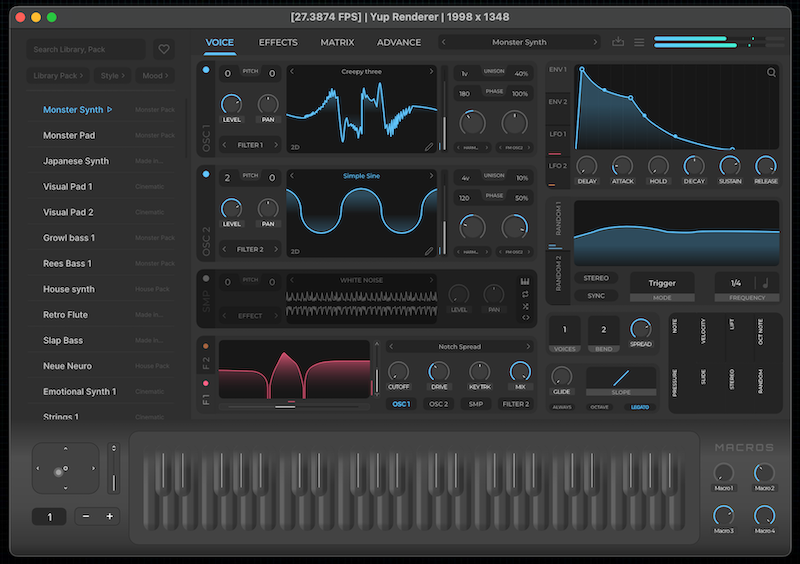
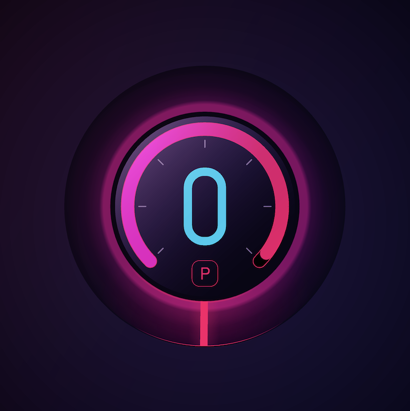
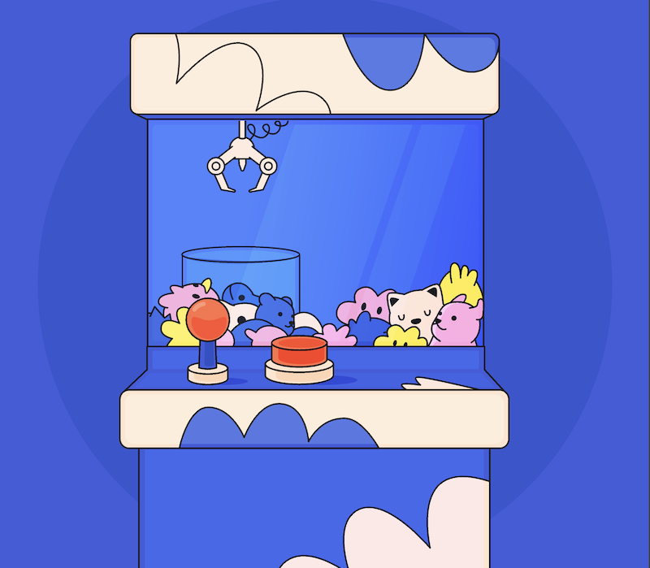

# YUP: Cross-Platform Application Development Library


UI courtesy from: https://www.drywestdesign.com/

[](https://kunitoki.github.io/yup/demos/web_render_1/)
[](https://kunitoki.github.io/yup/demos/web_render_2/)
[](https://kunitoki.github.io/yup/demos/web_render_3/)

[Renderer Youtube Video](https://youtube.com/shorts/3XC4hyDlrVs)

## Disclaimer: The Project Is Still In Embryonic Stage

[](https://github.com/kunitoki/yup/actions/workflows/build_macos.yml)
[](https://github.com/kunitoki/yup/actions/workflows/build_windows.yml)
[](https://github.com/kunitoki/yup/actions/workflows/build_linux.yml)
[](https://github.com/kunitoki/yup/actions/workflows/build_wasm.yml)

## Introduction
YUP is an open-source library dedicated to empowering developers with advanced tools for cross-platform application development, featuring state-of-the-art rendering and audio processing. Originating from a fork of JUCE7's ISC-licensed modules, YUP builds on the robust, high-performance capabilities that made JUCE7 popular among audio and visual application developers. Unlike its successor JUCE8, which moved to a restrictive AGPL license and an even more costly commercial one, YUP maintains the more permissive ISC license, ensuring that it remains a freely accessible and modifiable resource for developers worldwide.

## Features
YUP brings a suite of powerful features, including:
- **High-Performance Rendering:** From intricate visualizations to high-speed gaming graphics, YUP handles it all with ease and efficiency, relying on the open source Rive Renderer, backed by Metal, Direct3D, OpenGL and WebGPU.
- **Advanced Audio Processing:** Tailored for professionals, our audio toolkit delivers pristine sound quality with minimal latency, suitable for music production, live performance tools, and more.
- **Cross-Platform Compatibility:** Consistent and reliable on Windows, macOS, Linux (with Wasm, iOS and Android in the pipe).
- **Extensive Testing Infrastructure:** Massive set of unit and integration tests to validate functionality.
- **Community-Driven Development:** As an open-source project, YUP thrives on contributions from developers around the globe.

## Getting Started
To begin using YUP, follow these detailed steps to set up the environment and run a simple example application:

### Prerequisites
Ensure you have the following installed:
- C++17 compatible compiler
- CMake 3.28 or later

### Installation
Clone the YUP repository and build the library using the following commands:

```bash
git clone https://github.com/kunitoki/yup.git
cd yup
mkdir build
cmake -B build
```

### Running Your First Application
Here is a simple example of creating a basic window using YUP:

```cpp
// TODO
```

Save this as `main.cpp` and compile it using:

```bash
# TODO
```

This will open a window titled "Hello YUP" with dimensions 800x600.

## Documentation
For full documentation, including more detailed tutorials and comprehensive API references, please visit [YUP Documentation](https://yup.github.io/docs).

## Community Engagement
Join our growing community and contribute to the YUP project. Connect with us and other YUP developers:
- **GitHub:** [YUP Repository](https://github.com/kunitoki/yup)

## Contributing
Interested in contributing? Here's how you can help:
1. Fork the repository.
2. Create a new branch for your changes (`git checkout -b feature/AmazingFeature`).
3. Commit your changes (`git commit -m 'Add some AmazingFeature'`).
4. Push to the branch (`git push origin feature/AmazingFeature`).
5. Open a Pull Request.

## License
YUP is distributed under the ISC License, supporting both personal and commercial use, modification, and distribution without restrictions.

## Acknowledgments
YUP was born in response to JUCE8’s shift to a more restrictive licensing model. By forking JUCE7’s community-driven, ISC-licensed modules, we aim to preserve and continue a legacy of high-quality, freely accessible software development. We are grateful to the JUCE7 community for laying the groundwork for this initiative.
