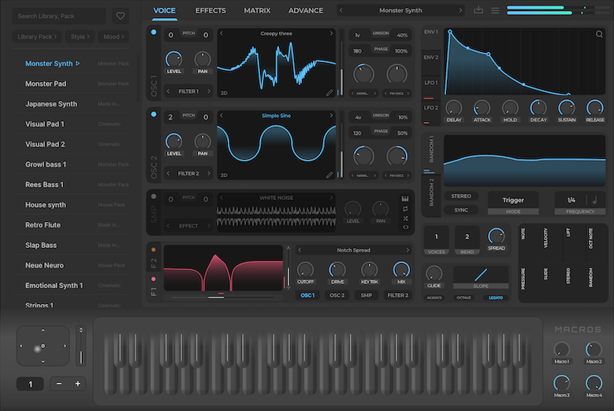
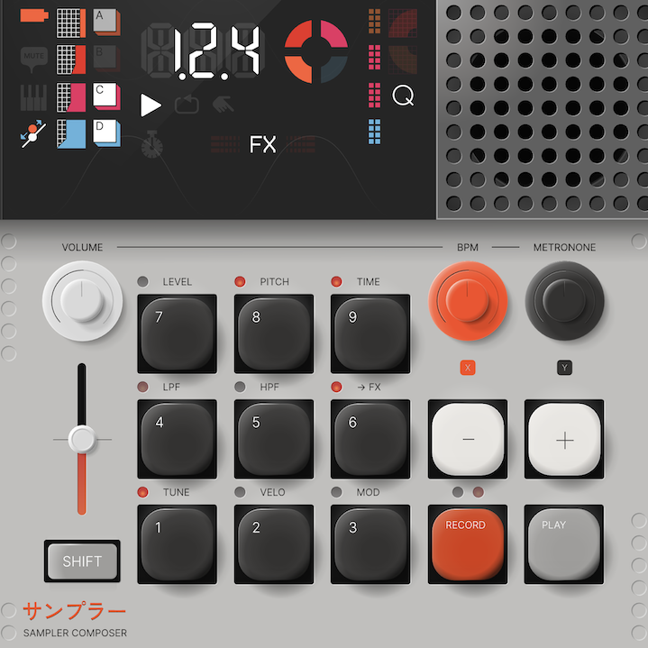
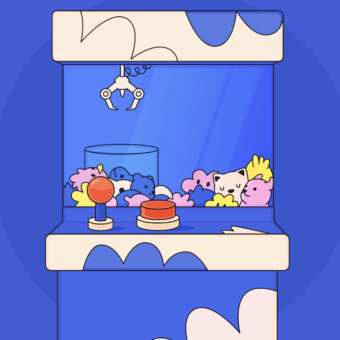
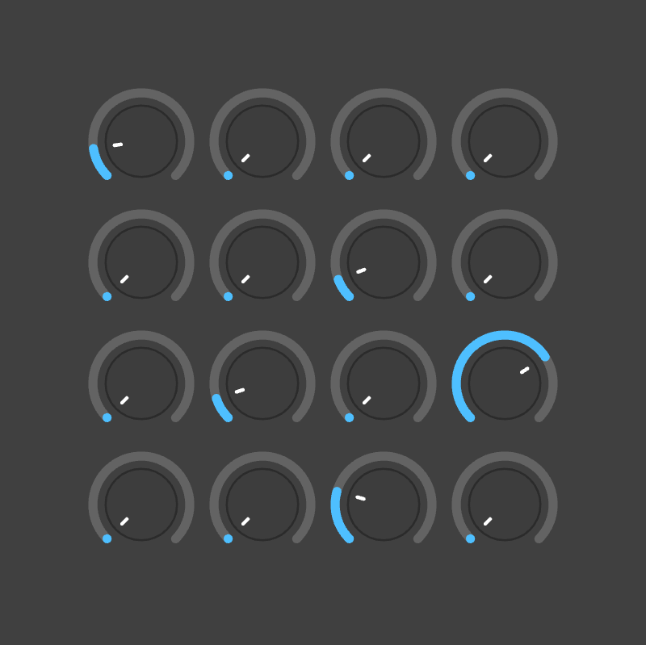
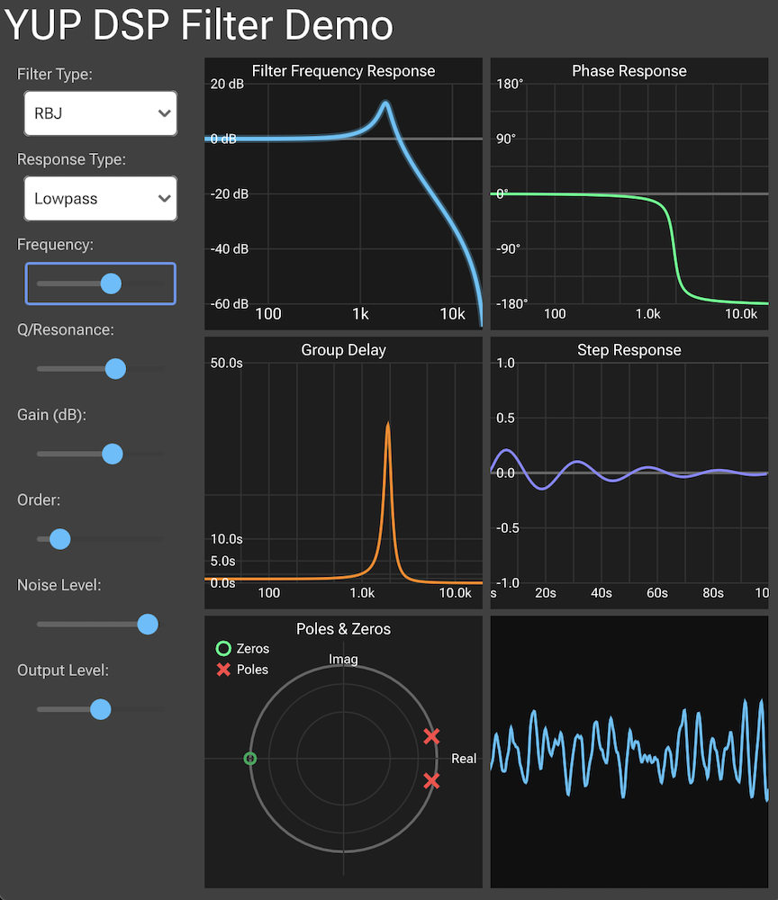
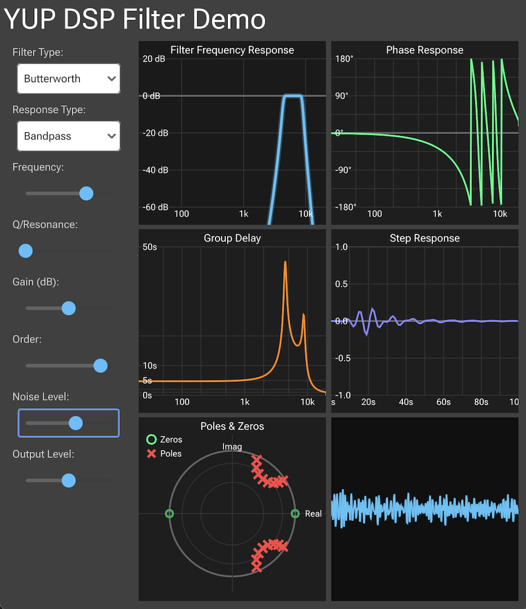
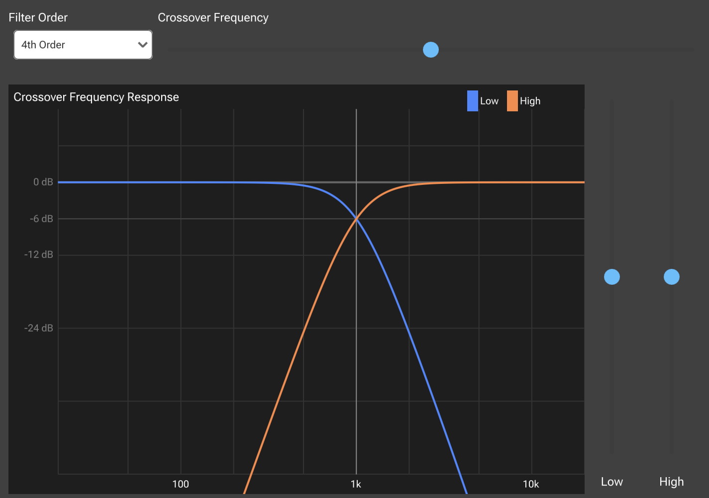
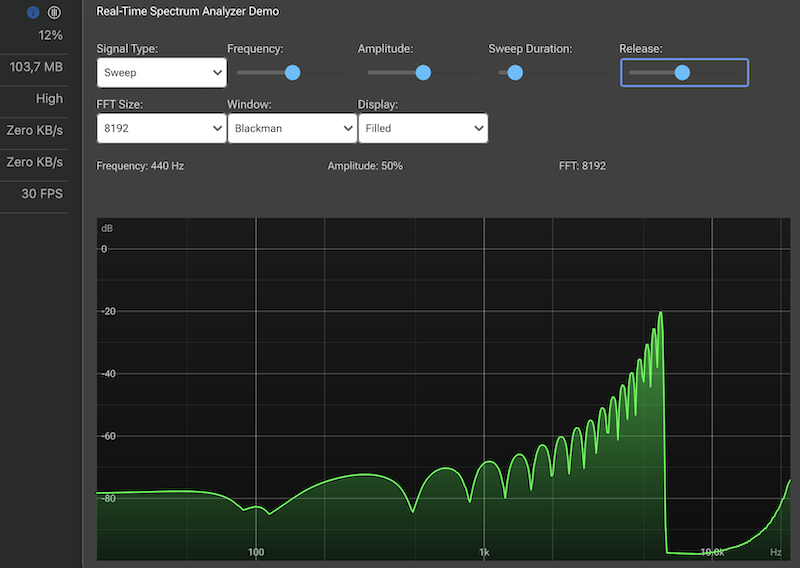
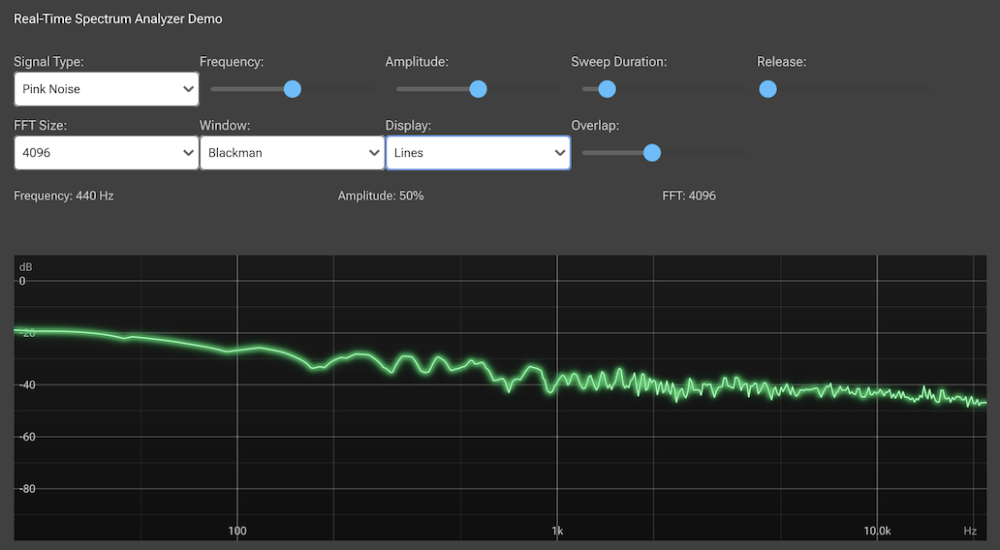

# YUP: Cross-Platform Application And Plugin Development Library

<div style="display: flex; width: 100%; flex-wrap: nowrap;">
  <a href="https://kunitoki.github.io/yup/demos/web_render_0/" title="UI courtesy from https://www.drywestdesign.com/">
    </a>
</div>

<div style="display: flex; width: 100%; flex-wrap: nowrap;">
  <a href="https://kunitoki.github.io/yup/demos/web_render_1/"></a>
  <a href="https://kunitoki.github.io/yup/demos/web_render_2/"></a>
  <a href="https://kunitoki.github.io/yup/demos/web_render_3/"></a>
  <a href="https://kunitoki.github.io/yup/demos/web_render_4/"></a>
</div>

<div style="display: flex; width: 100%; flex-wrap: nowrap;">
  <a href="./examples/graphics/source/examples/FilterDemo.h"></a>
  <a href="./examples/graphics/source/examples/FilterDemo.h"></a>
  <a href="./examples/graphics/source/examples/CrossoverDemo.h"></a>
</div>

<div style="display: flex; width: 100%; flex-wrap: nowrap;">
  <a href="./examples/graphics/source/examples/SpectrumAnalyzer.h"></a>
  <a href="./examples/graphics/source/examples/SpectrumAnalyzer.h"></a>
</p>

Example Rive animation display ([source code](./examples/render/source/main.cpp)):
[Renderer Youtube Video](https://youtube.com/shorts/3XC4hyDlrVs)

[](https://github.com/kunitoki/yup/actions/workflows/build_macos.yml)
[](https://github.com/kunitoki/yup/actions/workflows/build_windows.yml)
[](https://github.com/kunitoki/yup/actions/workflows/build_linux.yml)
[](https://github.com/kunitoki/yup/actions/workflows/build_wasm.yml)
[](https://github.com/kunitoki/yup/actions/workflows/build_ios.yml)
[](https://github.com/kunitoki/yup/actions/workflows/build_android.yml)

[](https://github.com/kunitoki/yup/actions/workflows/coverage.yml)
[](https://codecov.io/gh/kunitoki/yup)

[](https://codecov.io/gh/kunitoki/yup)

## Introduction
YUP is an open-source library dedicated to empowering developers with advanced tools for cross-platform application and plugin development, featuring state-of-the-art rendering and audio processing. Originating from a fork of [JUCE7](https://juce.com/)'s ISC-licensed modules, YUP builds on the robust, high-performance capabilities that made JUCE7 popular among audio and visual application developers. Unlike its successor JUCE8, which moved to a restrictive AGPL license and an even more costly commercial one, YUP maintains the more permissive ISC license and ensures that all of its dependencies are either liberally licensed or public domain, remaining a freely accessible and modifiable resource for developers worldwide.


> [!CAUTION]
> The project is still in embryonic stage, use it at your own risk!


> [!IMPORTANT]
> We are looking for collaborators to bring forward the framework!


## Features
YUP brings a suite of powerful features, including:
- **High-Performance Rendering:** From intricate visualizations to high-speed gaming graphics, YUP handles it all with ease and efficiency, relying on the open source [Rive](https://rive.app/) Renderer, backed by Metal, Direct3D, OpenGL, Vulkan and WebGPU.
- **Advanced Audio Processing:** Tailored for professionals, our audio toolkit delivers pristine sound quality with minimal latency, suitable for music production, live performance tools, and more. Based on the JUCE7 module for audio/midi input and output.
- **Open Source Audio Plugin Standards:** Facilitates the development of [CLAP](https://cleveraudio.org/) and [VST3](https://github.com/steinbergmedia/vst3sdk) plugin abstractions, providing a framework for creating versatile and compatible audio plugins.
- **Cross-Platform Compatibility:** Consistent and reliable on Windows, macOS, Linux, Wasm, iOS and Android.
- **Extensive Testing Infrastructure:** Massive set of unit and integration tests to validate functionality.
- **Community-Driven Development:** As an open-source project, YUP thrives on contributions from developers around the globe.


## Supported Platforms
| **Windows**        | **macOS**          | **Linux**          | **WASM**           | **Android**        | **iOS**            |
|:------------------:|:------------------:|:------------------:|:------------------:|:------------------:|:------------------:|
| :white_check_mark: | :white_check_mark: | :white_check_mark: | :white_check_mark: | :white_check_mark: | :white_check_mark: |


## Supported Rendering Backends
|                          | **Windows**        | **macOS**          | **Linux**          | **WASM**           | **Android**               | **iOS**               |
|--------------------------|:------------------:|:------------------:|:------------------:|:------------------:|:-------------------------:|:---------------------:|
| **OpenGL 4.2**           | :white_check_mark: |                    | :white_check_mark: |                    |                           |                       |
| **OpenGL ES3.0**         |                    |                    |                    |                    | :white_check_mark:        |                       |
| **WebGL2 (GLES3.0)**     |                    |                    |                    | :white_check_mark: |                           |                       |
| **Metal**                |                    | :white_check_mark: |                    |                    |                           | :white_check_mark:    |
| **Direct3D 11**          | :white_check_mark: |                    |                    |                    |                           |                       |
| **Vulkan**               | :construction:     |                    | :construction:     |                    | :construction:            |                       |
| **WebGPU**               | :construction:     | :construction:     | :construction:     | :construction:     | :construction:            | :construction:        |


## Supported Audio Backends
|                          | **Windows**        | **macOS**          | **Linux**          | **WASM**           | **Android**               | **iOS**               |
|--------------------------|:------------------:|:------------------:|:------------------:|:------------------:|:-------------------------:|:---------------------:|
| **CoreAudio**            |                    | :white_check_mark: |                    |                    |                           | :white_check_mark:    |
| **ASIO**                 | :white_check_mark: |                    |                    |                    |                           |                       |
| **DirectSound**          | :white_check_mark: |                    |                    |                    |                           |                       |
| **WASAPI**               | :white_check_mark: |                    |                    |                    |                           |                       |
| **ALSA**                 |                    |                    | :white_check_mark: |                    |                           |                       |
| **JACK**                 | :white_check_mark: | :white_check_mark: | :white_check_mark: |                    |                           |                       |
| **Oboe**                 |                    |                    |                    |                    | :white_check_mark:        |                       |
| **OpenSL**               |                    |                    |                    |                    | :white_check_mark:        |                       |
| **AudioWorklet**         |                    |                    |                    | :white_check_mark: |                           |                       |


## Supported Plugin Formats
|                          | **CLAP**           | **VST3**           | **VST2**           | **AUv3**           | **AUv2**                  | **AAX**               | **LV2**               |
|--------------------------|:------------------:|:------------------:|:------------------:|:------------------:|:-------------------------:|:---------------------:|:---------------------:|
| **Windows**              | :construction:     | :construction:     |                    |                    |                           |                       |                       |
| **macOS**                | :white_check_mark: | :construction:     |                    |                    | :construction:            |                       |                       |
| **Linux**                | :construction:     | :construction:     |                    |                    |                           |                       |                       |


## Prerequisites
Before building, ensure you have a:
- C++17-compliant compiler
- CMake 3.28 or later


### Windows
Visual Studio 2022.


### macOS and iOS
Xcode 15.2 (and command-line tools).


### Linux
Required packages:

```bash
sudo apt-get update && sudo apt-get install -y \
    libasound2-dev libjack-jackd2-dev ladspa-sdk libcurl4-openssl-dev libfreetype6-dev \
    libx11-dev libxcomposite-dev libxcursor-dev libxcursor-dev libxext-dev libxi-dev libxinerama-dev \
    libxrandr-dev libxrender-dev libglu1-mesa-dev mesa-common-dev
```


### Wasm
Emscripten SDK (at least version 3.1.45).


### Android
JDK 17, Android SDK, and NDK (at least r26d).


## Installation
Clone the YUP repository:

```bash
git clone https://github.com/kunitoki/yup.git
cd yup
```

## Using just
To ease bootstrapping, a provided `justfile` allows to quickly launch default configurations (see https://github.com/casey/just for more information):

```bash
$ just
Available recipes:
    android                                 # generate and open project for Android using Android Studio
    build CONFIG="Debug"                    # build project using cmake
    clean                                   # clean project build artifacts
    c                                       # alias for `clean`
    default                                 # list available recipes
    emscripten CONFIG="Debug"               # generate build and serve project for WASM
    emscripten_serve CONFIG="Debug"         # serve project for WASM
    ios PLATFORM="OS64"                     # generate and open project for iOS using Xcode
    ios_simulator PLATFORM="SIMULATORARM64" # generate and open project for iOS Simulator macOS using Xcode
    linux PROFILING="OFF"                   # generate project in Linux using Ninja
    mac PROFILING="OFF"                     # generate and open project in macOS using Xcode
    win PROFILING="OFF"                     # generate and open project in Windows using Visual Studio
```

## Preparing the build directory
Create a Dedicated Build Directory:

```bash
mkdir -p build
```


## Configure and Build
Generate the build system files with CMake.


### Windows / Linux / macOS
For a standard desktop build with tests and examples enabled, run:

```bash
cmake . -B build -DYUP_ENABLE_TESTS=ON -DYUP_ENABLE_EXAMPLES=ON
cmake --build build --config Release --parallel 4
```


### Android
Android will rely on cmake for configuration and gradlew will again call into cmake to build the native part of yup:

```bash
cmake -G "Ninja Multi-Config" . -B build -DYUP_TARGET_ANDROID=ON -DYUP_ENABLE_TESTS=ON -DYUP_ENABLE_EXAMPLES=ON
cd build/examples/render
./gradlew assembleRelease
# ./gradlew assembleDebug
```


### iOS
You can either use Ninja or Xcode:

```bash
cmake -G "Ninja Multi-Config" . -B build -DCMAKE_TOOLCHAIN_FILE=cmake/toolchains/ios.cmake -DPLATFORM=OS64 -DYUP_ENABLE_TESTS=ON -DYUP_ENABLE_EXAMPLES=ON
cmake --build build --config Release --parallel 4
```


### Wasm
Use Emscripten’s helper command, after having activated the emsdk (refer to https://emscripten.org/docs/getting_started/downloads.html how to install and activate Emscripten):

```bash
emcmake cmake -G "Ninja Multi-Config" . -B build -DYUP_ENABLE_TESTS=ON -DYUP_ENABLE_EXAMPLES=ON
cmake --build build --config Release --parallel 4
python3 -m http.server -d build
```

These command builds the project in Release mode. Replace `Release` with `Debug` if you need a debug build.


## Running Tests and Examples
After compilation, you can validate the build and explore YUP’s features:

- Run Tests:
Build and execute the yup_tests target to run the automated test suite.

- Build Examples:
Compile example targets like example_app, example_console, or example_render to see practical implementations.


## Running Your First Application
Here is a simple example of creating a basic window using YUP, save this as `main.cpp`:

```cpp
#include <yup_core/yup_core.h>
#include <yup_events/yup_events.h>
#include <yup_graphics/yup_graphics.h>
#include <yup_gui/yup_gui.h>

class MyWindow : public yup::DocumentWindow
{
public:
    MyWindow()
        : yup::DocumentWindow (yup::ComponentNative::Options(), {})
    {
        setTitle ("MyWindow");

        takeFocus();
    }

    void paint (yup::Graphics& g) override
    {
        g.setFillColor (0xffffffff);
        g.fillAll();
    }

    void userTriedToCloseWindow() override
    {
        yup::YUPApplication::getInstance()->systemRequestedQuit();
    }
};

struct MyApplication : yup::YUPApplication
{
    MyApplication() = default;

    const yup::String getApplicationName() override
    {
        return "MyApplication";
    }

    const yup::String getApplicationVersion() override
    {
        return "1.0";
    }

    void initialise (const yup::String& commandLineParameters) override
    {
        window = std::make_unique<MyWindow>();
        window->centreWithSize ({ 1080, 2400 });
        window->setVisible (true);
        window->toFront(true);
    }

    void shutdown() override
    {
        window.reset();
    }

private:
    std::unique_ptr<MyWindow> window;
};

START_YUP_APPLICATION (MyApplication)
```

And add this as `CMakeLists.txt`:

```cmake
cmake_minimum_required (VERSION 3.28)

set (target_name my_app)
set (target_version "0.0.1")
project (${target_name} VERSION ${target_version})

include (FetchContent)

FetchContent_Declare(
  yup
  GIT_REPOSITORY https://github.com/kunitoki/yup.git
  GIT_TAG        main)

set (YUP_BUILD_EXAMPLES OFF)
set (YUP_BUILD_TESTS OFF)
FetchContent_MakeAvailable(yup)

yup_standalone_app (
    TARGET_NAME ${target_name}
    TARGET_VERSION ${target_version}
    TARGET_IDE_GROUP "MyApp"
    TARGET_APP_ID "my.company.${target_name}"
    TARGET_APP_NAMESPACE "my.company"
    INITIAL_MEMORY 268435456
    MODULES yup_gui)

if (NOT YUP_TARGET_ANDROID)
    file (GLOB sources "${CMAKE_CURRENT_LIST_DIR}/*.cpp")
    source_group (TREE ${CMAKE_CURRENT_LIST_DIR}/ FILES ${sources})
    target_sources (${target_name} PRIVATE ${sources})
endif()
```


## Documentation
For full documentation, including more detailed tutorials and comprehensive API references, please visit [YUP Documentation](https://yup.github.io/docs).


## Community Engagement
Join our growing community and contribute to the YUP project. Connect with us and other YUP developers:
- **GitHub:** [YUP Repository](https://github.com/kunitoki/yup)


## License
YUP is distributed under the ISC License, supporting both personal and commercial use, modification, and distribution without restrictions.


## Acknowledgments
YUP was born in response to JUCE8’s shift to a more restrictive licensing model. By forking JUCE7’s community-driven, ISC-licensed modules, we aim to preserve and continue a legacy of high-quality, freely accessible software development. We are grateful to the JUCE7 community for laying the groundwork for this initiative.
