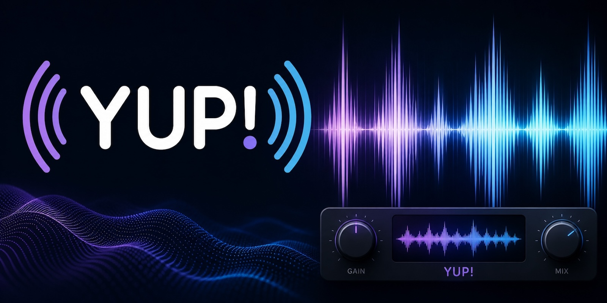

# YUP! The modern framework optimized for realtime audio and GPU-native creative software

YUP is a C++20 framework for building native applications, audio tools, and audio plugins with one codebase across desktop, mobile, and the web. It combines permissively licensed JUCE7-derived foundations with modern rendering through the open source [Rive](https://rive.app/) renderer and YUP's own evolving graphics, GUI, DSP, audio graph, and plugin layers.

[](https://github.com/kunitoki/yup/actions/workflows/build_macos.yml)
[](https://github.com/kunitoki/yup/actions/workflows/build_windows.yml)
[](https://github.com/kunitoki/yup/actions/workflows/build_linux.yml)
[](https://github.com/kunitoki/yup/actions/workflows/build_wasm.yml)
[](https://github.com/kunitoki/yup/actions/workflows/build_ios.yml)
[](https://github.com/kunitoki/yup/actions/workflows/build_android.yml)
[](https://github.com/kunitoki/yup/actions/workflows/coverage.yml)
[](https://codecov.io/gh/kunitoki/yup)

> [!WARNING]
> YUP is under active early-stage development. APIs may change while the framework is being shaped, but the repository already contains working examples, tests, and platform builds.

## Why YUP?

- **Permissive by default:** ISC-licensed project code, with dependencies chosen for liberal licensing or public-domain availability.
- **Modern vector rendering:** GPU-backed rendering through the Rive renderer, with Metal, Direct3D, OpenGL, WebGL, and in-progress Vulkan/WebGPU support.
- **Audio-first application stack:** Audio devices, MIDI, formats, DSP, audio graph components, plugin hosting, and plugin client wrappers live in the same framework.
- **Native and web targets:** Windows, macOS, Linux, Wasm, Android, and iOS are part of the regular CI surface.
- **CMake-first workflow:** Use YUP as a standalone repository or bring it into your own app/plugin project with `FetchContent`.

## Try It

- Run the browser demos: [demo 1](https://kunitoki.github.io/yup/demos/web_render_0/), [demo 2](https://kunitoki.github.io/yup/demos/web_render_1/), [demo 3](https://kunitoki.github.io/yup/demos/web_render_2/), [demo 4](https://kunitoki.github.io/yup/demos/web_render_3/), [demo 5](https://kunitoki.github.io/yup/demos/web_render_4/).
- Explore the example apps: [graphics](./examples/graphics), [audio graph](./examples/audiograph), [plugin](./examples/plugin), [console](./examples/console).
- Read the build guides: [standalone applications](./docs/Building%20Standalone.md), [audio plugins](./docs/Building%20Plugins.md), [module format](./docs/YUP%20Module%20Format.md).

## Screenshots and Demos

<div style="display: flex; width: 100%; flex-wrap: nowrap;">
  <a href="https://kunitoki.github.io/yup/demos/web_render_0/" title="UI courtesy from https://www.drywestdesign.com/">
    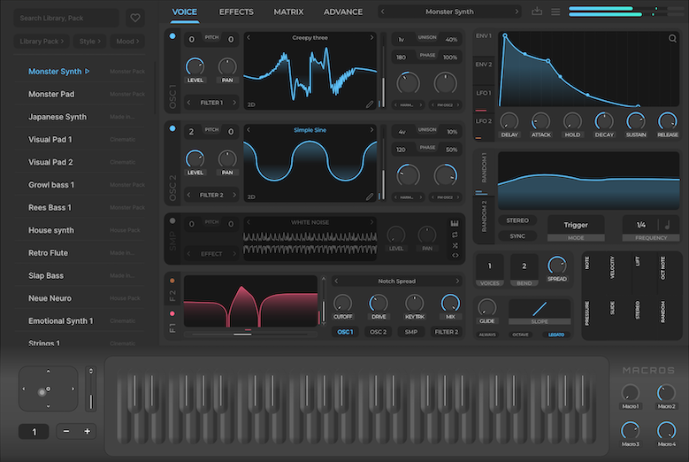</a>
</div>

<div style="display: flex; width: 100%; flex-wrap: nowrap;">
  <a href="https://kunitoki.github.io/yup/demos/web_render_1/"></a>
  <a href="https://kunitoki.github.io/yup/demos/web_render_2/">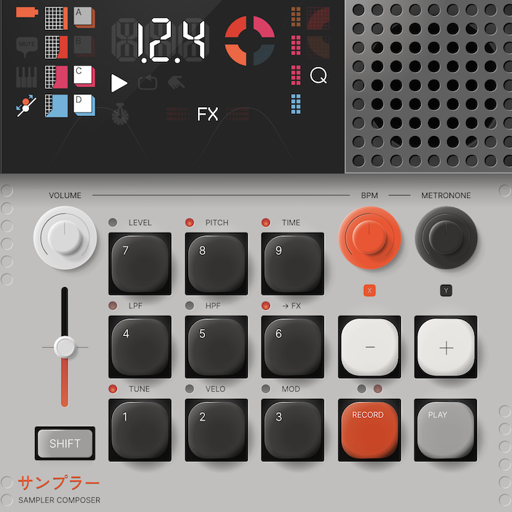</a>
  <a href="https://kunitoki.github.io/yup/demos/web_render_3/">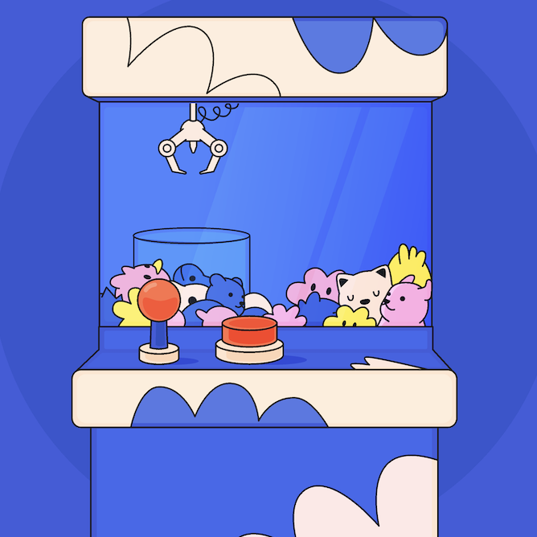</a>
  <a href="https://kunitoki.github.io/yup/demos/web_render_4/">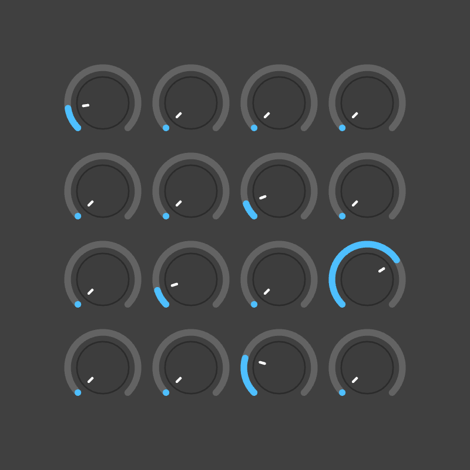</a>
</div>

<div style="display: flex; width: 100%; flex-wrap: nowrap;">
  <a href="./examples/graphics/source/examples/Svg.h">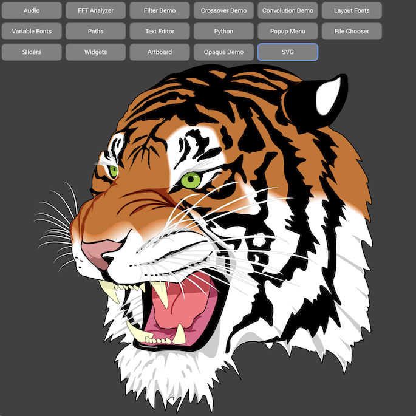</a>
  <a href="./examples/graphics/source/examples/Svg.h">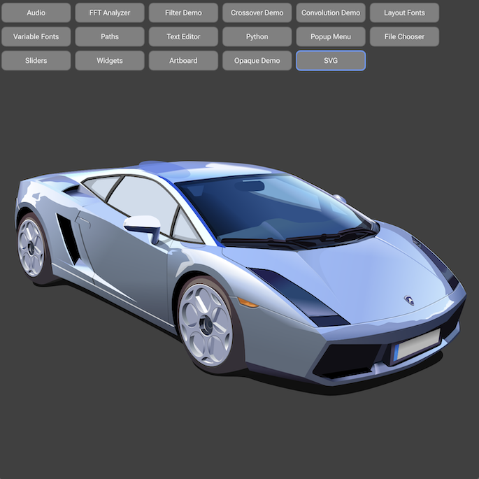</a>
  <a href="./examples/graphics/source/examples/Svg.h">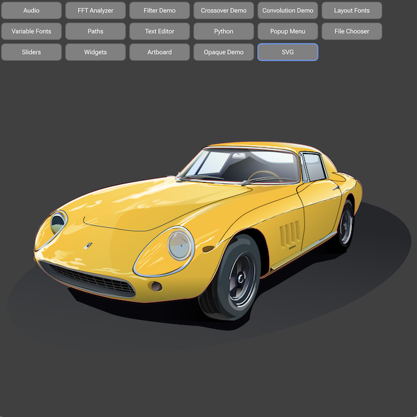</a>
</div>

<div style="display: flex; width: 100%; flex-wrap: nowrap;">
  <a href="./examples/graphics/source/examples/ColorLab.h">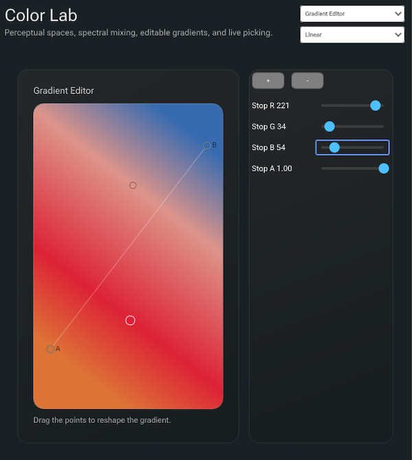</a>
  <a href="./examples/graphics/source/examples/ColorLab.h">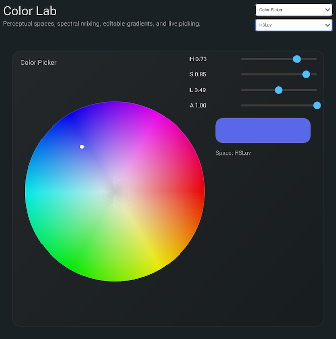</a>
</div>

<div style="display: flex; width: 100%; flex-wrap: nowrap;">
  <a href="./examples/audiograph/">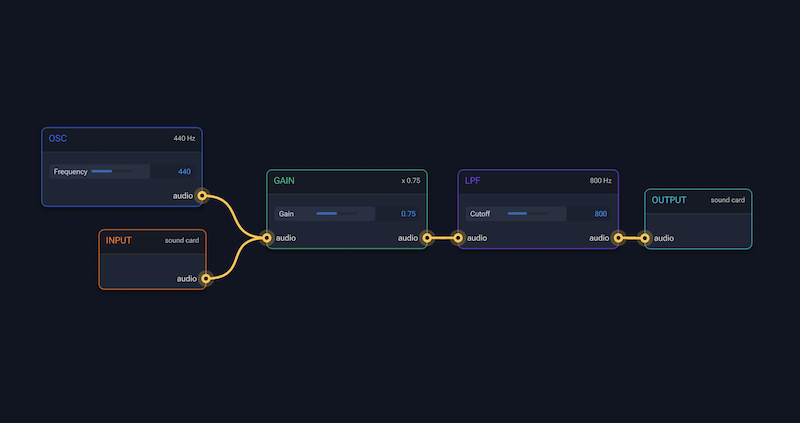</a>
  <a href="./examples/graphics/source/examples/AudioFileDemo.h">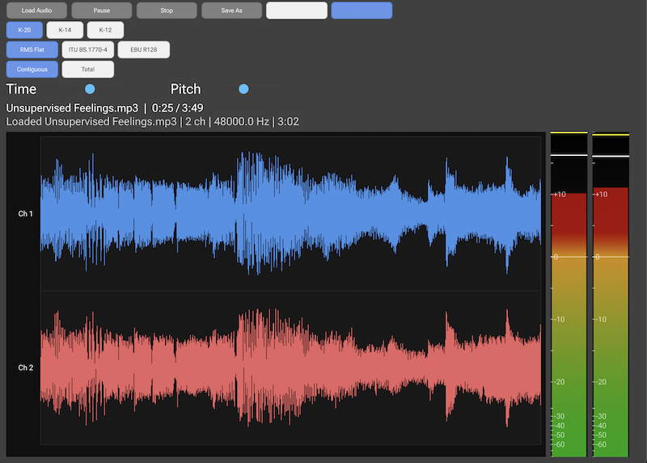</a>
</div>

<div style="display: flex; width: 100%; flex-wrap: nowrap;">
  <a href="./examples/audiograph/">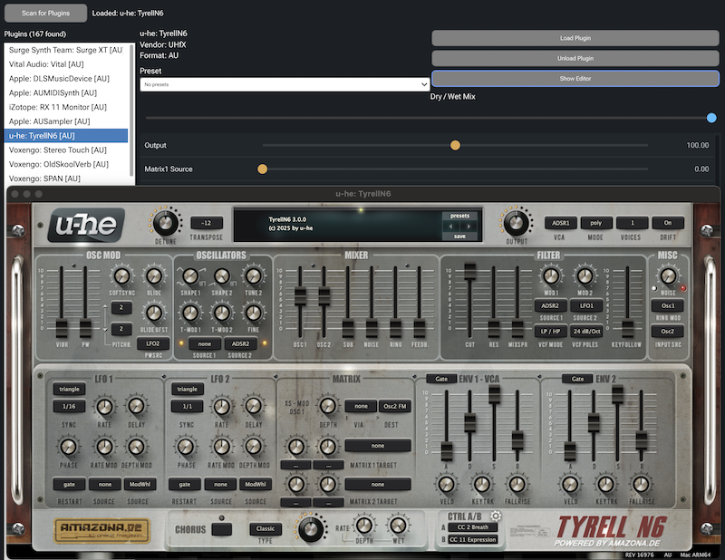</a>
</div>

<div style="display: flex; width: 100%; flex-wrap: nowrap;">
  <a href="./examples/graphics/source/examples/FilterDemo.h">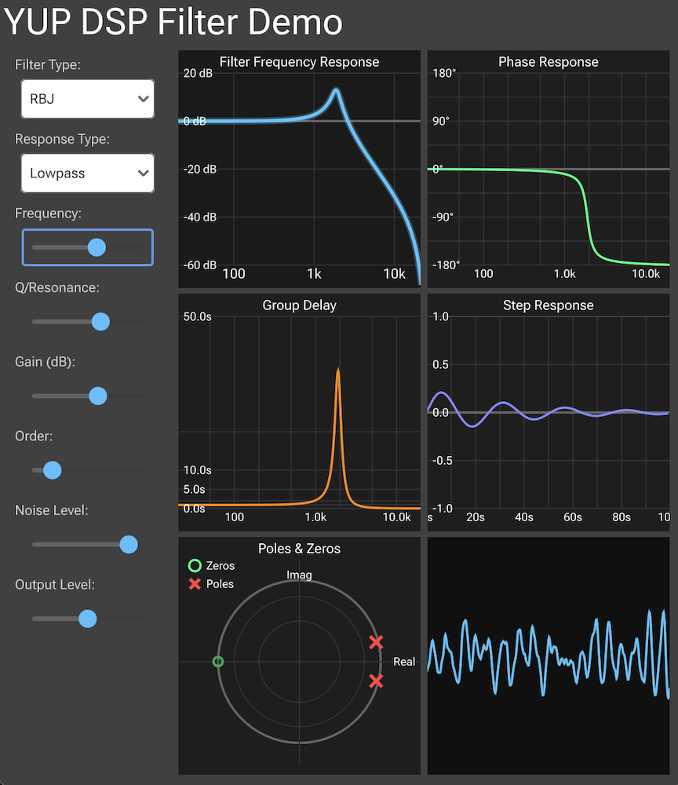</a>
  <a href="./examples/graphics/source/examples/FilterDemo.h">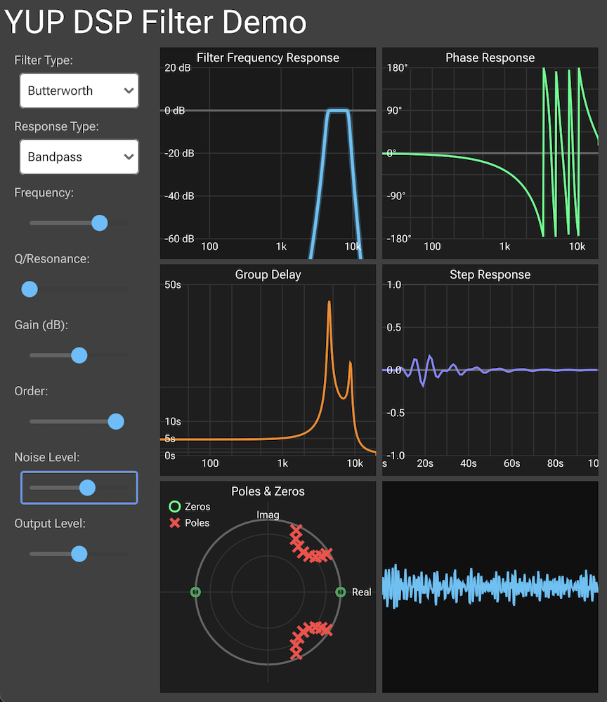</a>
  <a href="./examples/graphics/source/examples/CrossoverDemo.h">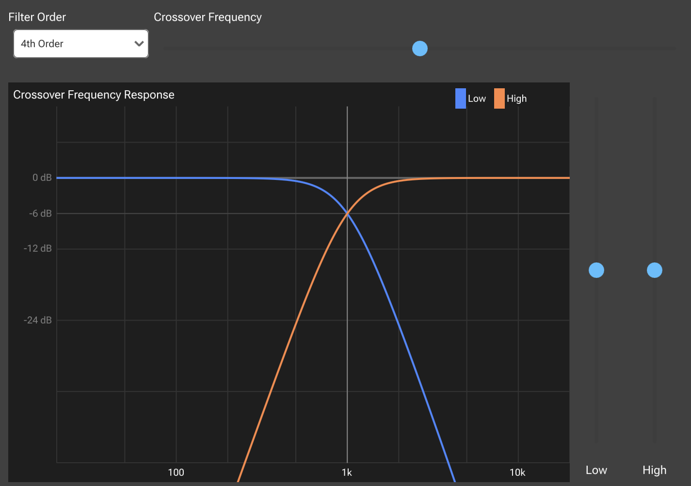</a>
</div>

<div style="display: flex; width: 100%; flex-wrap: nowrap;">
  <a href="./examples/graphics/source/examples/AudioFileDemo.h">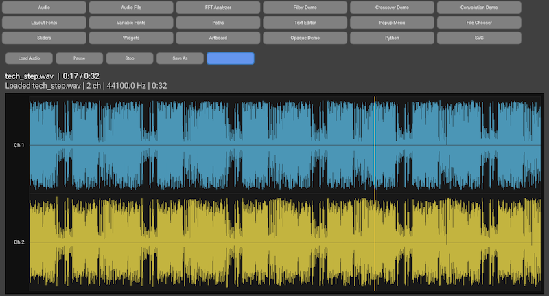</a>
</div>

<div style="display: flex; width: 100%; flex-wrap: nowrap;">
  <a href="./examples/graphics/source/examples/SpectrumAnalyzer.h">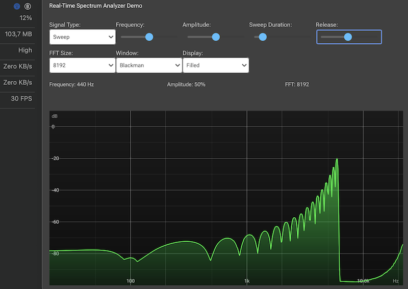</a>
  <a href="./examples/graphics/source/examples/SpectrumAnalyzer.h">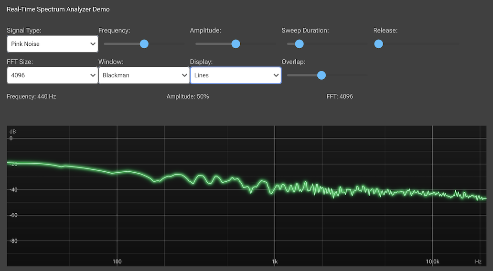</a>
</div>

Example Rive animation display: [source code](./examples/graphics/source/main.cpp), [renderer video](https://youtube.com/shorts/3XC4hyDlrVs).

<details>
<summary>Coverage drilldown</summary>

[](https://codecov.io/gh/kunitoki/yup)

</details>

## Project Status

YUP is usable for experimentation, examples, prototypes, and contributors who are comfortable with a fast-moving framework. The areas most ready for feedback are:

- graphics and GUI rendering across desktop and Wasm;
- DSP and audio analysis components;
- audio graph editing and visualization;
- CLAP/VST3 plugin creation and hosting;
- documentation, examples, and platform coverage.


## Supported Platforms
| **Windows**        | **macOS**          | **Linux**          | **WASM**           | **Android**        | **iOS**            |
|:------------------:|:------------------:|:------------------:|:------------------:|:------------------:|:------------------:|
| :white_check_mark: | :white_check_mark: | :white_check_mark: | :white_check_mark: | :white_check_mark: | :white_check_mark: |


## Supported Rendering Backends
|                          | **Windows**        | **macOS**          | **Linux**          | **WASM**           | **Android**               | **iOS**               |
|--------------------------|:------------------:|:------------------:|:------------------:|:------------------:|:-------------------------:|:---------------------:|
| **OpenGL 4.2**           | :white_check_mark: |                    | :white_check_mark: |                    |                           |                       |
| **OpenGL ES3.0**         |                    |                    |                    |                    | :white_check_mark:        |                       |
| **WebGL2 (GLES3.0)**     |                    |                    |                    | :white_check_mark: |                           |                       |
| **Metal**                |                    | :white_check_mark: |                    |                    |                           | :white_check_mark:    |
| **Direct3D 11**          | :white_check_mark: |                    |                    |                    |                           |                       |
| **Vulkan**               | :construction:     |                    | :construction:     |                    | :construction:            |                       |
| **WebGPU**               | :construction:     | :construction:     | :construction:     | :construction:     | :construction:            | :construction:        |


## Supported Audio Backends
|                          | **Windows**        | **macOS**          | **Linux**          | **WASM**           | **Android**               | **iOS**               |
|--------------------------|:------------------:|:------------------:|:------------------:|:------------------:|:-------------------------:|:---------------------:|
| **CoreAudio**            |                    | :white_check_mark: |                    |                    |                           | :white_check_mark:    |
| **ASIO**                 | :white_check_mark: |                    |                    |                    |                           |                       |
| **DirectSound**          | :white_check_mark: |                    |                    |                    |                           |                       |
| **WASAPI**               | :white_check_mark: |                    |                    |                    |                           |                       |
| **ALSA**                 |                    |                    | :white_check_mark: |                    |                           |                       |
| **JACK**                 | :white_check_mark: | :white_check_mark: | :white_check_mark: |                    |                           |                       |
| **Oboe**                 |                    |                    |                    |                    | :white_check_mark:        |                       |
| **OpenSL**               |                    |                    |                    |                    | :white_check_mark:        |                       |
| **AudioWorklet**         |                    |                    |                    | :white_check_mark: |                           |                       |


## Supported Plugin Formats
|                          | **CLAP**           | **VST3**           | **VST2**           | **AUv3**           | **AUv2**                  | **AAX**               | **LV2**               |
|--------------------------|:------------------:|:------------------:|:------------------:|:------------------:|:-------------------------:|:---------------------:|:---------------------:|
| **Windows**              | :white_check_mark: | :construction:     |                    |                    |                           |                       |                       |
| **macOS**                | :white_check_mark: | :white_check_mark: |                    |                    | :white_check_mark:        |                       |                       |
| **Linux**                | :construction:     | :construction:     |                    |                    |                           |                       |                       |


## Supported Plugin Hosting Formats
|                          | **CLAP**           | **VST3**           | **VST2**           | **AUv3**           | **AUv2**                  | **AAX**               | **LV2**               |
|--------------------------|:------------------:|:------------------:|:------------------:|:------------------:|:-------------------------:|:---------------------:|:---------------------:|
| **Windows**              | :construction:     | :construction:     |                    |                    |                           |                       |                       |
| **macOS**                | :white_check_mark: | :white_check_mark: |                    |                    | :white_check_mark:        |                       |                       |
| **Linux**                | :construction:     | :construction:     |                    |                    |                           |                       |                       |


## Supported Sound Formats
|                   | **Wav**            | **Wav64**          | **Mp3**            | **OGG**            | **Flac**           | **Opus**           | **AAC**            | **WMF**            |
|-------------------|:------------------:|:------------------:|:------------------:|:------------------:|:------------------:|:------------------:|:------------------:|:------------------:|
| **Windows** (enc) | :white_check_mark: | :white_check_mark: | :white_check_mark: | :white_check_mark: | :white_check_mark: | :white_check_mark: | :white_check_mark: | :white_check_mark: |
| **Windows** (dec) | :white_check_mark: | :white_check_mark: | :white_check_mark: | :white_check_mark: | :white_check_mark: | :white_check_mark: | :white_check_mark: | :white_check_mark: |
| **macOS** (enc)   | :white_check_mark: | :white_check_mark: | :white_check_mark: | :white_check_mark: | :white_check_mark: | :white_check_mark: | :white_check_mark: |                    |
| **macOS** (dec)   | :white_check_mark: | :white_check_mark: | :white_check_mark: | :white_check_mark: | :white_check_mark: | :white_check_mark: | :white_check_mark: |                    |
| **Linux** (enc)   | :white_check_mark: | :white_check_mark: | :white_check_mark: | :white_check_mark: | :white_check_mark: | :white_check_mark: |                    |                    |
| **Linux** (dec)   | :white_check_mark: | :white_check_mark: | :white_check_mark: | :white_check_mark: | :white_check_mark: | :white_check_mark: |                    |                    |
| **WASM** (enc)    | :white_check_mark: | :white_check_mark: | :white_check_mark: | :white_check_mark: | :white_check_mark: | :white_check_mark: |                    |                    |
| **WASM** (dec)    | :white_check_mark: | :white_check_mark: | :white_check_mark: | :white_check_mark: | :white_check_mark: | :white_check_mark: |                    |                    |
| **Android** (enc) | :white_check_mark: | :white_check_mark: | :white_check_mark: | :white_check_mark: | :white_check_mark: | :white_check_mark: | :construction:     |                    |
| **Android** (dec) | :white_check_mark: | :white_check_mark: | :white_check_mark: | :white_check_mark: | :white_check_mark: | :white_check_mark: | :construction:     |                    |
| **iOS** (enc)     | :white_check_mark: | :white_check_mark: | :white_check_mark: | :white_check_mark: | :white_check_mark: | :white_check_mark: | :white_check_mark: |                    |
| **iOS** (dec)     | :white_check_mark: | :white_check_mark: | :white_check_mark: | :white_check_mark: | :white_check_mark: | :white_check_mark: | :white_check_mark: |                    |


## Prerequisites
Before building, make sure you have:
- C++20-compliant compiler
- CMake 3.31 or later


### Windows
Visual Studio 2022.


### macOS and iOS
Xcode 15.2 (and command-line tools).


### Linux
Required packages:

```bash
sudo apt-get update && sudo apt-get install -y \
    libasound2-dev libjack-jackd2-dev ladspa-sdk libcurl4-openssl-dev libfreetype6-dev \
    libx11-dev libxcomposite-dev libxcursor-dev libxext-dev libxi-dev libxinerama-dev \
    libxrandr-dev libxrender-dev libglu1-mesa-dev mesa-common-dev
```


### Wasm
Emscripten SDK (at least version 4.0.22).


### Android
JDK 17, Android SDK, and NDK (at least r26d).


## Installation
Clone the YUP repository:

```bash
git clone https://github.com/kunitoki/yup.git
cd yup
```

## Using just
To ease bootstrapping, the provided `justfile` wraps common CMake workflows (see https://github.com/casey/just for more information):

```bash
$ just
Available recipes:
    android                                 # generate and open project for Android
    build CONFIG="Debug"                    # build project using cmake
    clean                                   # clean project build artifacts
    c                                       # alias for `clean`
    default                                 # list available recipes
    emscripten CONFIG="Debug"               # generate and build project for WASM
    emscripten_test CONFIG="Debug"          # run tests for WASM
    emscripten_serve                        # serve project for WASM
    ios PLATFORM="OS64"                     # generate and open project for iOS using Xcode
    ios_simulator PLATFORM="SIMULATORARM64" # generate and open project for iOS Simulator macOS using Xcode
    linux PROFILING="OFF"                   # generate project in Linux using Ninja
    mac PROFILING="OFF"                     # generate and open project in macOS using Xcode
    ninja PROFILING="OFF"                   # generate project using Ninja Multi-Config
    win PROFILING="OFF"                     # generate and open project in Windows using Visual Studio
```


## Preparing the build directory
Create a dedicated build directory:

```bash
mkdir -p build
```


## Configure and Build
Generate the build system files with CMake.


### Windows / Linux / macOS
For a standard desktop build with tests and examples enabled, run:

```bash
cmake -S . -B build -DYUP_BUILD_TESTS=ON -DYUP_BUILD_EXAMPLES=ON
cmake --build build --config Release --parallel 4
```


### Android
Android will rely on cmake for configuration and gradlew will again call into cmake to build the native part of yup:

```bash
cmake -G "Ninja Multi-Config" -S . -B build -DYUP_TARGET_ANDROID=ON -DYUP_BUILD_TESTS=ON -DYUP_BUILD_EXAMPLES=ON
cd build/examples/graphics
./gradlew assembleRelease
# ./gradlew assembleDebug
```


### iOS
You can either use Ninja or Xcode:

```bash
cmake -G "Ninja Multi-Config" -S . -B build -DCMAKE_TOOLCHAIN_FILE=cmake/toolchains/ios.cmake -DPLATFORM=OS64 -DYUP_BUILD_TESTS=ON -DYUP_BUILD_EXAMPLES=ON
cmake --build build --config Release --parallel 4
```


### Wasm
Use Emscripten’s helper command, after having activated the emsdk (refer to https://emscripten.org/docs/getting_started/downloads.html how to install and activate Emscripten):

```bash
emcmake cmake -G "Ninja Multi-Config" -S . -B build -DYUP_BUILD_TESTS=ON -DYUP_BUILD_EXAMPLES=ON
cmake --build build --config Release --parallel 4
python3 -m http.server -d build
```

These commands build the project in Release mode. Replace `Release` with `Debug` if you need a debug build.


## Running Tests and Examples
After compilation, you can validate the build and explore YUP’s features:

- Run tests:
Build and execute the `yup_tests` target to run the automated test suite.

- Build examples:
Compile example targets like `example_app`, `example_console`, or `example_graphics` to see practical implementations.


## Running Your First Application
Here is a simple example of creating a basic window using YUP, save this as `main.cpp`:

```cpp
#include <yup_core/yup_core.h>
#include <yup_events/yup_events.h>
#include <yup_graphics/yup_graphics.h>
#include <yup_gui/yup_gui.h>

class MyWindow : public yup::DocumentWindow
{
public:
    MyWindow()
        : yup::DocumentWindow (yup::ComponentNative::Options(), {})
    {
        setTitle ("MyWindow");

        takeFocus();
    }

    void paint (yup::Graphics& g) override
    {
        g.setFillColor (0xffffffff);
        g.fillAll();
    }

    void userTriedToCloseWindow() override
    {
        yup::YUPApplication::getInstance()->systemRequestedQuit();
    }
};

struct MyApplication : yup::YUPApplication
{
    MyApplication() = default;

    const yup::String getApplicationName() override
    {
        return "MyApplication";
    }

    const yup::String getApplicationVersion() override
    {
        return "1.0";
    }

    void initialise (const yup::String& commandLineParameters) override
    {
        window = std::make_unique<MyWindow>();
        window->centreWithSize ({ 1080, 2400 });
        window->setVisible (true);
        window->toFront (true);
    }

    void shutdown() override
    {
        window.reset();
    }

private:
    std::unique_ptr<MyWindow> window;
};

START_YUP_APPLICATION (MyApplication)
```

And add this as `CMakeLists.txt`:

```cmake
cmake_minimum_required (VERSION 3.31)

set (target_name my_app)
set (target_version "0.0.1")
project (${target_name} VERSION ${target_version})

include (FetchContent)

FetchContent_Declare(
  yup
  GIT_REPOSITORY https://github.com/kunitoki/yup.git
  GIT_TAG        main)

set (YUP_BUILD_EXAMPLES OFF)
set (YUP_BUILD_TESTS OFF)
FetchContent_MakeAvailable(yup)

yup_standalone_app (
    TARGET_NAME ${target_name}
    TARGET_VERSION ${target_version}
    TARGET_IDE_GROUP "MyApp"
    TARGET_APP_ID "my.company.${target_name}"
    TARGET_APP_NAMESPACE "my.company"
    TARGET_CXX_STANDARD 20
    INITIAL_MEMORY 268435456
    MODULES yup::yup_gui)

if (NOT YUP_TARGET_ANDROID)
    file (GLOB sources "${CMAKE_CURRENT_LIST_DIR}/*.cpp")
    source_group (TREE ${CMAKE_CURRENT_LIST_DIR}/ FILES ${sources})
    target_sources (${target_name} PRIVATE ${sources})
endif()
```


## Documentation
Start with the guides in this repository:

- [Building standalone applications](./docs/Building%20Standalone.md)
- [Building audio plugins](./docs/Building%20Plugins.md)
- [DataTree tutorial](./docs/tutorials/DataTree%20Tutorial.md)
- [YUP module format](./docs/YUP%20Module%20Format.md)

## Contributing
YUP is looking for collaborators who want to help shape a permissively licensed C++ app, graphics, audio, and plugin framework. Useful contributions include:

- testing examples on real hardware and DAWs;
- improving platform-specific build and packaging paths;
- writing focused examples and tutorials;
- reporting API friction while building real applications;
- contributing DSP, GUI, audio graph, and plugin-hosting fixes.

Open an issue or pull request on the [YUP repository](https://github.com/kunitoki/yup).


## License
YUP is distributed under the ISC License, supporting both personal and commercial use, modification, and distribution without restrictions.


## Acknowledgments
YUP continues from the ISC-licensed JUCE7 modules and builds on the work of the JUCE community. The goal is to preserve that permissive foundation while evolving the rendering, audio, plugin, and cross-platform application layers in a direction that remains open for commercial and non-commercial projects.
