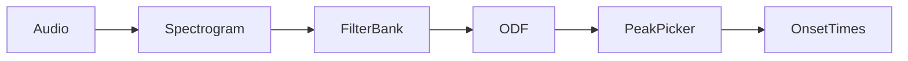

# Onset detection

The `onsets/` layer implements a complete offline onset-detection pipeline
inspired by the state of the art (Böck & Widmer; Böck, Krebs & Schedl): a
magnitude spectrogram, an optional log-spaced filter bank, a spectral-flux
onset detection function, and a generic peak picker with optional
sample-accurate refinement.

The pipeline, in order:



## Spectrogram

`Spectrogram` computes an STFT **magnitude** spectrogram from an offline
buffer. Frames are stored flat, row-major as `[numFrames x numBins]`, where
`numBins` is the filter-bank band count when a filter bank is attached,
otherwise `fftSize / 2`.

```cpp
yup::Spectrogram::Parameters params;
params.fftSize  = 2048;                 // power of two, >= 64
params.fps      = 200;                  // frames per second (hop = round (fs / fps))
params.windowType = yup::WindowType::hann;
params.useLog   = true;                 // log10 (logMul * mag + logAdd)
params.computeLGD = false;              // Local Group Delay (needed by ComplexFluxODF)
params.filterBank = nullptr;            // optional FilterBank*

yup::Spectrogram spec;
spec.prepare (params, 44100.0f);
spec.processOffline (samples, numSamples);
```

`processOffline` zero-pads at the edges and emits `getMagnitudeData()`.
When `computeLGD` is enabled it also computes the **Local Group Delay** (the
negative frequency-derivative of the unwrapped STFT phase) at raw resolution
`[numFrames x fftSize/2]`, available via `getLGDData()`.

## FilterBank

`FilterBank` maps FFT bins onto a smaller set of perceptually motivated,
log-spaced triangular bands — for example 24 bands per octave (quarter-tone
resolution). Band centers are generated log-spaced from A440 and rounded to
FFT bins; each band's triangle spans from the previous center to the next.

```cpp
yup::FilterBank bank;
bank.build (24, 30.0f, 17000.0f, fftSize / 2, 44100.0f);
bank.applySingleFrame (magnitudeIn, magnitudeOut);      // bins -> bands
bank.applyMultipleFrames (spectrogram, filtered, numFrames);
```

By default every band has height `1.0`; pass `equalizeArea = true` to scale
each band to unit area. `fMax` is clamped to Nyquist.

## Onset detection functions

`OnsetDetectionFunction` is the abstract interface: `compute (spec)` fills a
one-value-per-frame activation signal whose peaks mark onsets
(`getActivations()`). Two implementations are provided.

### SuperFluxODF

SuperFlux ("Maximum Filter Vibrato Suppression for Onset Detection", Böck &
Widmer, DAFx-13) computes the positive first-order difference of a
*max-filtered* magnitude spectrogram, summed across bins per frame. The max
filter (width `maxFilterBins`, default 3) suppresses vibrato:

```cpp
yup::SuperFluxODF::Parameters p;
p.diffFrames = 0;           // 0 = auto-derive from the window magnitude ratio
p.windowMagRatio = 0.5f;
p.maxFilterBins = 3;

yup::SuperFluxODF odf;
odf.prepare (p, window.data(), windowSize, hopSize);
odf.compute (spec);
```

### ComplexFluxODF

ComplexFlux ("Local group delay based vibrato and tremolo suppression for
onset detection", Böck & Widmer, ISMIR 2013) extends SuperFlux by weighting
the difference spectrogram with a mask derived from the STFT Local Group
Delay. It **requires** the spectrogram to have been computed with
`computeLGD = true`:

```cpp
yup::ComplexFluxODF::Parameters p;
p.temporalFilter = 3;       // temporal max-filter size for LGD smoothing; 0 disables

yup::ComplexFluxODF odf;
odf.prepare (p, window.data(), windowSize, hopSize);
odf.compute (spec);
```

## OnsetPeakPicker

`OnsetPeakPicker` is algorithm-agnostic: it detects peaks in any float
activation array ("Evaluating the Online Capabilities of Onset Detection
Methods", Böck, Krebs & Schedl, ISMIR 2012). A frame is an onset when it is
the local moving maximum over `[frame − preMax, frame + postMax]` **and**
exceeds `movingAverage + threshold`. A `combineSec` window suppresses
double-detections.

```cpp
yup::OnsetPeakPicker::Parameters p;
p.threshold  = 1.1f;    // higher = fewer detections
p.combineSec = 0.03f;   // min spacing between onsets
p.preAvgSec  = 0.15f;
p.preMaxSec  = 0.01f;
p.postAvgSec = 0.0f;    // 0 = online
p.postMaxSec = 0.05f;

yup::OnsetPeakPicker picker;
picker.prepare (p, fps);
picker.detect (activations.data(), numFrames);
auto times = picker.getOnsetTimes();   // seconds
```

`onlineMode` forces the future windows to zero so onsets are reported with no
look-ahead (at the cost of accuracy). The optional
`refineOnsetTimes (samples, numSamples, sampleRate, maxRefineSec, threshold)`
moves each detected onset to a sample-accurate position by walking back from
the peak of the RMS envelope (with dynamic-threshold triggering) to the
nearest zero crossing.

## OnsetDetector

`OnsetDetector` orchestrates the whole chain — it owns the `Spectrogram`,
the `FilterBank`, an `OnsetDetectionFunction` (SuperFlux or ComplexFlux) and
an `OnsetPeakPicker`:

```cpp
yup::OnsetDetector detector;
detector.prepare ({
    .spectrogram   = { .fftSize = 2048, .fps = 200 },
    .useFilterBank = true,
    .bandsPerOctave = 24,
    .useComplexFlux = true,          // vs. SuperFlux
    .peakPicker    = { .threshold = 0.25f },   // lower for ComplexFlux
    .refineOnsets  = false,          // optional sample-accurate refinement
}, 44100.0f);

detector.processOffline (audioBuffer);        // AudioBuffer<float> (stereo = L+R average) or raw samples

for (auto t : detector.getOnsetTimes())
    DBG ("Onset at " << t << "s");
```

Key `Parameters` fields: `spectrogram`, `superFluxODF`, `complexFluxODF`,
`peakPicker`, `useFilterBank` / `bandsPerOctave` / `fMin` / `fMax` /
`equalizeFilterArea`, `useComplexFlux`, and the refinement options
(`refineOnsets`, `refineMaxSec`, `refineThreshold`).

Accessors: `getActivationFunction()` (ODF activations), `getOnsetTimes()`
(seconds), `getNumFrames()`, `getSpectrogram()`, `getParameters()`.

## Typical default chain

With the default parameters at 44.1 kHz: `Spectrogram` (2048-point FFT, 200
fps → hop ≈ 221 samples, Hann window, `log10(mag + 1)`) → `FilterBank` (24
bands/octave, 30 Hz–17 kHz) → `SuperFluxODF` (auto `diffFrames`, max filter
width 3) → `OnsetPeakPicker` (threshold 1.1, combine 0.03 s, pre-average
0.15 s, pre-max 0.01 s, post-max 0.05 s) → onset times in seconds.

## Related

- [Frequency domain](frequency.md) - `FFTProcessor` powers the `Spectrogram`
  and `FilterBank` machinery.
- [Math & windowing](math.md) - the Hann and other windows used before the FFT.
