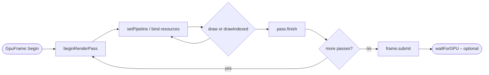

# Concepts & Lifecycle

## The `ore` bridge

Every RHI type is a thin, portable wrapper over a single backend bridge: Rive's
`ore` GPU context. The `GraphicsContext` owns that context and exposes it to the
RHI layer. You never touch `ore` types directly - the RHI hides them behind
YUP-native handles (`GpuPipeline`, `GpuFrame`, `GpuRenderPass`, `GpuBuffer`,
`GpuTexture`).

Because the RHI targets one common abstraction, the same code path runs on every
backend: Metal, Direct3D, OpenGL / OpenGL ES (including WebGL2), and WebGPU.

## Enabling the GPU context

The RHI requires a `GraphicsContext` created with the `ore` GPU context enabled.
This is on by default:

```cpp
GraphicsContext::Options options;
options.enableOreContext = true; // default
```

If the context was created with `enableOreContext = false`, or the backend has
no GPU (a headless context), the RHI is unavailable.

## Probing capability

Always check GPU availability before creating RHI resources. Use the ore-free
capability probe on the context:

```cpp
if (! ctx.isGpuAvailable())
    return; // No GPU / ore context - fall back or bail out.
```

`isGpuAvailable()` is equivalent to querying the internal GPU context but does
not reference any `ore` type, so user code stays backend-clean.

RHI factory functions honor this contract:

- `GpuPipeline::compile(...)` requires `isGpuAvailable()`.
- `GpuBuffer::create(...)` returns `nullptr` if `ore` is unavailable.
- `GpuTarget::create(...)` / `GpuCanvas::create(...)` return `nullptr` if
  offscreen GPU resources cannot be allocated.

## The frame → pass → draw model

RHI rendering follows a strict hierarchy:

1. **Begin a frame** with `GpuFrame::begin(ctx)`. The frame owns the transient
   GPU resources (uniform buffers, texture views, samplers) created while
   encoding, and keeps them alive until submission completes.
2. **Begin one or more render passes** into a target
   (`GpuCanvas::beginRenderPass()` or `GpuTarget::beginRenderPass()`). Each pass
   records into the frame.
3. **Encode draws** on the pass: bind a `GpuPipeline`, set textures / uniform
   buffers / vertex / index buffers, then call `draw()` or `drawIndexed()`.
4. **Finish the pass** with `finish()` (or let it finish on destruction).
5. **Submit the frame** with `submit()` (or let it submit on destruction).



```cpp
auto frame = GpuFrame::begin (ctx);
auto pass  = target->beginRenderPass (frame, { true, Colors::black });
pass.setPipeline (*pipeline);
pass.draw (3);
pass.finish();
frame.submit();
```

## Ownership & lifetime rules

- **`GpuFrame` and `GpuRenderPass` are move-only stack RAII.** Their destructors
  submit / finish automatically, so explicit `submit()` / `finish()` calls are
  optional but recommended for clarity and error checking.
- **A pass must be finished before its frame is submitted.** Keep the pass in a
  narrower scope than the frame, or call `finish()` explicitly.
- **`GpuPipeline`, `GpuBuffer`, `GpuTexture`, `GpuTarget`, and `GpuCanvas` are
  reference-counted** (`::Ptr`). Keep at least one `Ptr` alive as long as you
  render from or sample the resource.
- **Pipelines are immutable and reusable.** All mutable binding state lives on
  the `GpuRenderPass`, so one compiled pipeline can serve many passes with
  different bindings. Compile once, reuse across frames.

## Immediate results

`submit()` does **not** block the CPU. If you need the rendered pixels
immediately (for readback), call `GpuFrame::waitForGPU()` after submitting, or
use the readback helpers on `GpuTarget` / `GpuCanvas`, which flush as needed.
