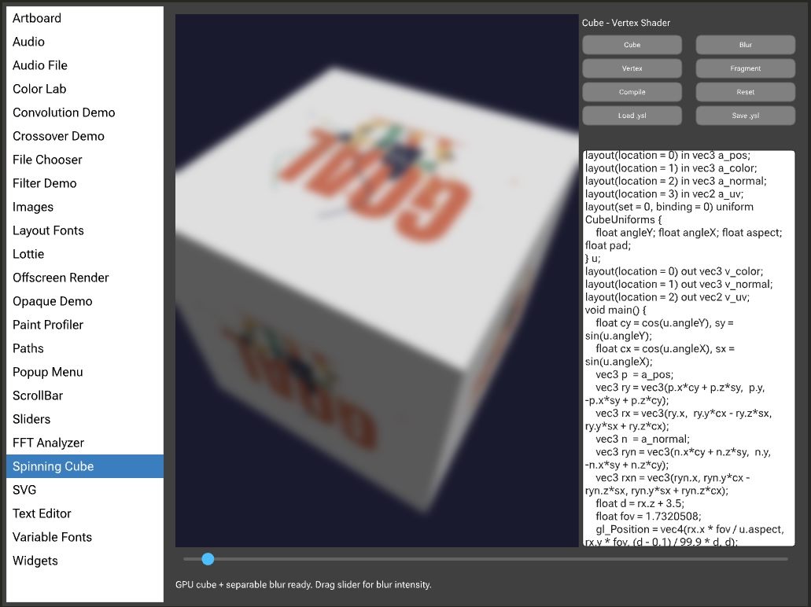

# Walkthrough: The Spinning Cube

This walkthrough ties the RHI together with an end-to-end example: a spinning 3D
cube rendered with a custom pipeline, textured with a live animation, and passed
through a separable Gaussian blur post-process.

The complete, runnable source lives in the graphics example under
[`examples/graphics/source/examples/SpinningCubeDemo.h`](https://github.com/kunitoki/yup/blob/main/examples/graphics/source/examples/SpinningCubeDemo.h).



## What it demonstrates

- Custom 3D geometry: per-vertex position / color / normal in a `GpuBuffer`,
  drawn with `drawIndexed()` and backface culling.
- A per-frame MVP transform pushed as a uniform buffer on the render pass.
- Runtime shader compilation via `GpuPipeline::compileFromGlsl()`.
- An offscreen 2D `GpuCanvas` used as an animated texture, sampled by the cube's
  fragment shader.
- A two-pass separable Gaussian blur post-process built from a second
  `GpuPipeline`, sharing one `GpuFrame`.

## 1. Probe for GPU support

Everything below requires an `ore` GPU context. Bail out early if it is missing:

```cpp
if (! ctx.isGpuAvailable())
{
    statusLabel->setText ("GPU unavailable", dontSendNotification);
    return;
}
```

## 2. Compile the cube pipeline

The cube uses a vertex + fragment shader pair. With the transpiler enabled, GLSL
450 is compiled directly; the binding-map sidecar is derived via reflection:

```cpp
GpuPipelineOptions options;
options.vertexBuffers       = &cubeLayout;   // position/color/normal
options.vertexBufferCount   = 1;
options.indexFormat         = GpuIndexFormat::uint16;
options.cullMode            = GpuCullMode::back;
options.winding             = GpuFaceWinding::counterClockwise;
options.depthStencil.enabled = true;

auto result = GpuPipeline::compileFromGlsl (ctx, vertGlsl, fragGlsl, options);
if (result.wasOk())
    cubePipeline = result.getValue();
else
    statusLabel->setText (result.getError(), dontSendNotification);
```

See [Pipelines & shaders](pipelines.md) for the vertex layout and options in
detail. For production, prefer [`compileFromBundle()`](pipelines.md#1-from-a-shader-bundle-recommended)
with a pre-built `.ysl` bundle, or cache pipelines with
[`GpuPipelineCache`](pipelines.md#gpupipelinecache).

## 3. Upload the geometry once

The cube's vertices and indices never change, so they live in immutable buffers
created once (not per frame):

```cpp
cubeVerts   = GpuBuffer::create (ctx, GpuBufferType::vertex, verts,   sizeof verts);
cubeIndices = GpuBuffer::create (ctx, GpuBufferType::index,  indices, sizeof indices);
```

## 4. Render the animated texture

The moving texture mapped onto each face is drawn with the 2D API into an
offscreen `GpuCanvas`, then handed to the cube shader as a texture:

```cpp
auto& g = textureCanvas->beginDraw();
// ... draw the current animation frame with g ...
auto animatedTexture = textureCanvas->asTexture(); // auto-commits the 2D frame
```

## 5. Encode the scene pass

Each frame, begin a `GpuFrame`, open a render pass on the scene canvas, bind the
pipeline + per-frame uniforms + geometry, and issue an indexed draw:

```cpp
auto frame = GpuFrame::begin (ctx);

auto pass = sceneCanvas->beginRenderPass (frame, { true, Colors::black });
pass.setPipeline (*cubePipeline);
pass.setUniformBuffer (0, 0, &mvp, sizeof mvp); // per-frame transform
pass.setTexture (0, 1, animatedTexture);
pass.setVertexBuffer (0, cubeVerts);
pass.setIndexBuffer (GpuIndexFormat::uint16, cubeIndices);
pass.drawIndexed (cubeIndexCount);
pass.finish();
```

## 6. Apply the blur post-process

The blur is a fullscreen pipeline (no vertex buffers). A separable Gaussian runs
as two passes - horizontal then vertical - sharing the same frame. Each pass
samples the previous result and generates its vertices from the vertex index:

```cpp
GpuRenderOptions load { false, Colors::transparentBlack };

auto hPass = blurCanvasH->beginRenderPass (frame, { true, Colors::transparentBlack });
hPass.setPipeline (*blurPipeline);
hPass.setTexture (0, 0, sceneCanvas->asTexture());
hPass.setUniformBuffer (0, 1, &horizontalParams, sizeof horizontalParams);
hPass.draw (3);
hPass.finish();

auto vPass = blurCanvasV->beginRenderPass (frame, { true, Colors::transparentBlack });
vPass.setPipeline (*blurPipeline);
vPass.setTexture (0, 0, blurCanvasH->asTexture());
vPass.setUniformBuffer (0, 1, &verticalParams, sizeof verticalParams);
vPass.draw (3);
vPass.finish();

frame.submit();
```

## 7. Composite to screen

Finally, draw the blurred result back into the component's 2D graphics:

```cpp
g.drawTexture (blurCanvasV->asTexture(), getLocalBounds());
```

## Takeaways

- **Compile once, render many.** Pipelines and static geometry buffers are
  created up front; only uniform data and bindings change per frame.
- **One frame, many passes.** Chain the scene pass and both blur passes into a
  single `GpuFrame` before submitting.
- **Textures are the glue.** `asTexture()` moves results between passes and back
  into the 2D `Graphics` API without CPU readback.

## See also

- [Concepts & lifecycle](concepts.md)
- [Frames & render passes](frames-and-passes.md)
- [Pipelines & shaders](pipelines.md)
- [Offscreen targets & canvases](targets.md)
