# Modules

YUP is organized into focused modules. Each module is a self-contained unit with
its own [module declaration](build-system/module-format.md) and follows the
`yup_*` naming convention. You depend on exactly the modules you need; transitive
dependencies are pulled in automatically by the [CMake API](build-system/cmake-api.md).

```{note}
All `yup_*` modules share the same version number. Modules also depend on a few
bundled third-party libraries (`zlib`, `rive`, `rive_renderer`, `libclipper2`,
`xsimd`), which are resolved for you by the build system.
```

## Required vs optional dependencies

Modules have two kinds of dependency:

- **Required (hard) dependencies** - declared in the module's
  [`dependencies:`](build-system/module-format.md) line and always linked. These
  are the solid arrows in the diagrams below (third-party ones drawn with a
  dashed outline).
- **Optional (soft) dependencies** - code guarded by
  `#if YUP_MODULE_AVAILABLE_<name>`. The feature is compiled in **only when that
  module/library is also present in the build**, and is silently skipped
  otherwise. There is no hard link, so optional deps never create dependency
  cycles. These are the dotted arrows labelled *optional*.

```{tip}
Optional dependencies are how you unlock extra features: link the optional
library into your target's `MODULES` and the guarded code activates
automatically. For example, adding `libpng` enables PNG support in
`yup_graphics` (see [Imaging](imaging/index.md)).
```

Beyond the ones shown, some base modules also *soft-detect* higher-level modules
purely for platform glue (e.g. `yup_core` and `yup_events` adapt their
Android/iOS message-loop integration when `yup_gui` is present). These are
internal integration points, activated automatically when both modules are in
the build, and are not something you add explicitly.

Each module is listed below with its dependencies. Arrows point from a module to
the things it depends on.

## Core

Foundational modules used across the whole framework. See the [Core](core/index.md) area.

### yup_core

The foundation every other module builds on: strings, containers, files and
streams, memory management, math, time, threading, networking, and data
interchange. It has no YUP dependencies and only pulls in `zlib` for
compression. Optionally integrates `sqlite3_library` to enable `SqliteDatabase`.

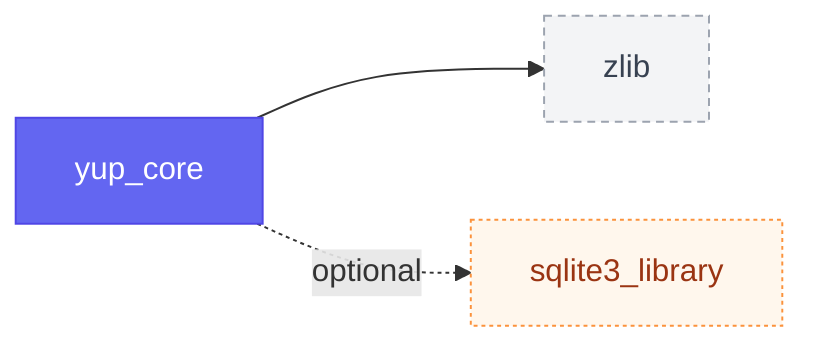

### yup_simd

Vectorized math primitives across SSE, AVX, FMA, NEON, and Apple's Accelerate
framework, wrapping the `xsimd` library behind a YUP-friendly API. Used wherever
tight numeric loops matter - DSP, audio, and graphics. Optionally provides
interop adapters for `eigen_library` when present.

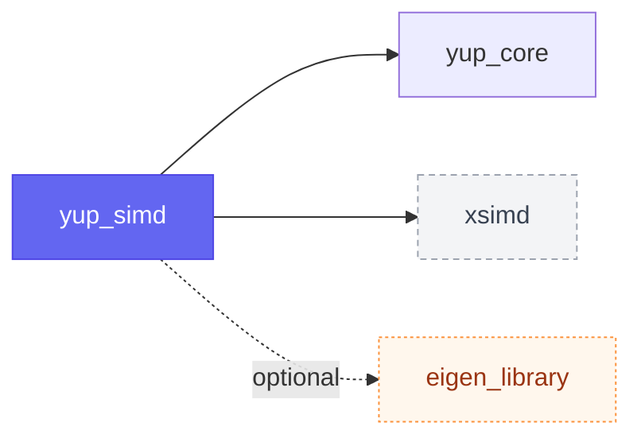

## Events & multithreading

The event loop and messaging layer. See the [Multithreading](multithreading/index.md)
area; threading primitives themselves live in `yup_core`.

### yup_events

The application event loop and messaging layer: the message thread, timers,
async callbacks, and inter-object notifications. It underpins any interactive or
long-running YUP application.


## AI

LLM clients, embeddings, and MCP (Model Context Protocol). See the [AI](ai/index.md) area.

### yup_ai

Chat-completion clients for OpenAI, Anthropic, and Gemini; function-calling tools;
text embeddings; and MCP client/server for tool/resource bridging — all over
HTTP or custom transports.

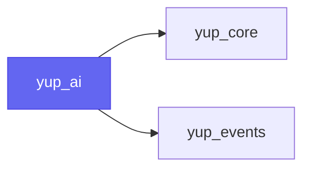

## Graphics

The rendering stack. See the [Graphics](graphics/index.md) area; bitmap image
handling is documented separately in the [Imaging](imaging/index.md) area.

### yup_shading

Shader authoring support: shader-source containers, transpilation, and the
`.ysl` shader-bundle format consumed by the graphics RHI for
[offline shader compilation](graphics/rhi/offline-shaders.md). When both
`glslang` and `spirv_cross` are present, the runtime shader transpiler
(`YUP_ENABLE_SHADER_TRANSPILER`) is enabled.

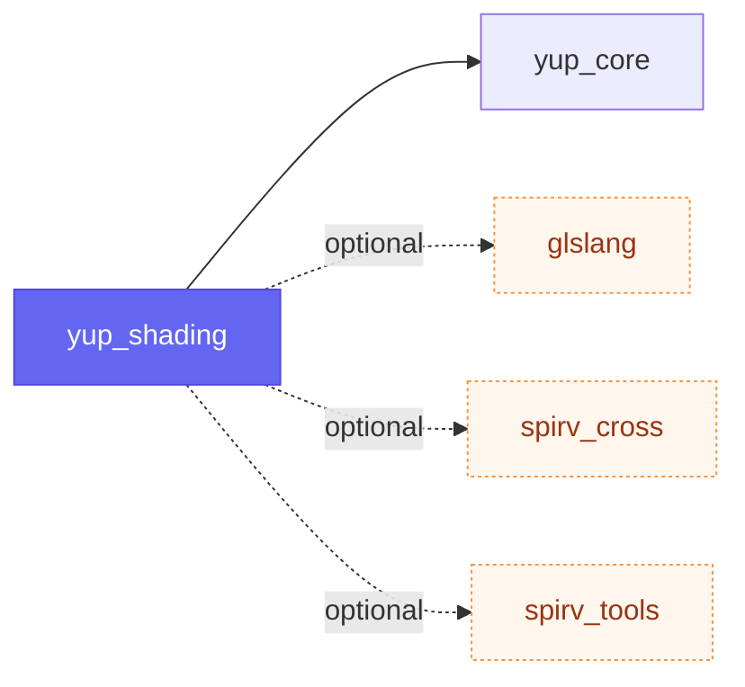

### yup_graphics

The 2D drawing stack and the low-level GPU RHI, rendered through the Rive
renderer. Covers the graphics context, primitives, paths, fonts, SVG, imaging,
and GPU pipelines. Image-codec support is optional: link `libpng`, `libjpeg`,
`libwebp`, and/or `libgif` to enable the corresponding [image formats](imaging/loading.md#available-formats).

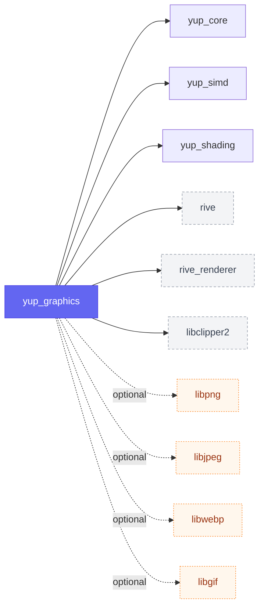

### yup_animation

A Lottie-compatible animation model with playback, rendering, and export,
layered on top of the graphics stack.

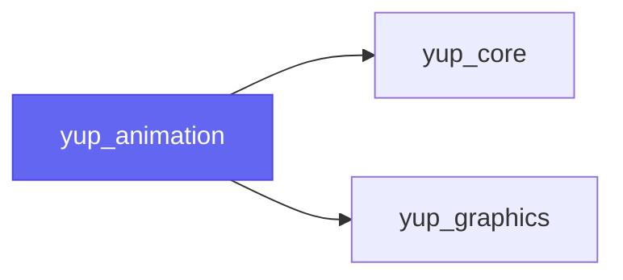

## Data

Structured, observable data models. See the [Data](data/index.md) area.

### yup_data_model

The `DataTree` data model: hierarchical, observable, transactional,
schema-validatable data with an XPath-like query engine.


## UI

The GUI toolkit. See the [UI](ui/index.md) area.

### yup_gui

The GUI toolkit: components, windowing, events, layout, and widgets that paint
through the graphics stack and bind to the data model.

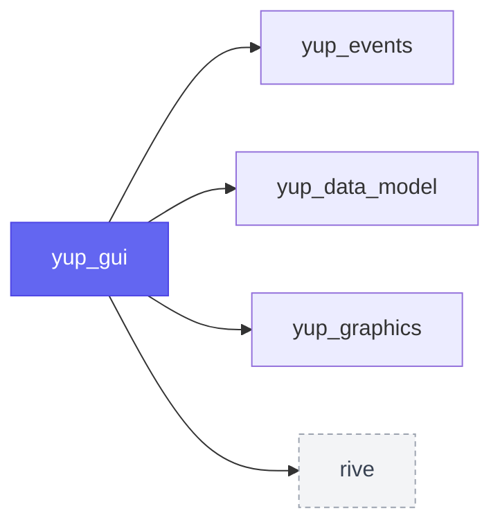

### yup_audio_gui

Audio-specific GUI components - waveforms, meters, spectrum analyzers, and
audio-graph editor views - bridging the UI and audio stacks.

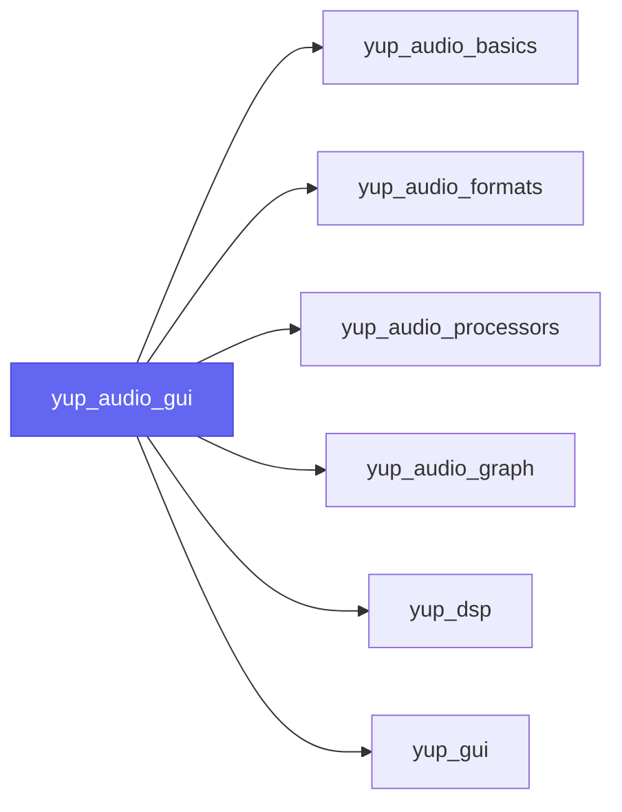

## Audio

The audio-first stack. See the [Audio](audio/index.md) area.

### yup_audio_basics

Core audio and MIDI data types: audio buffers, MIDI messages, synthesis
helpers, and processing utilities.

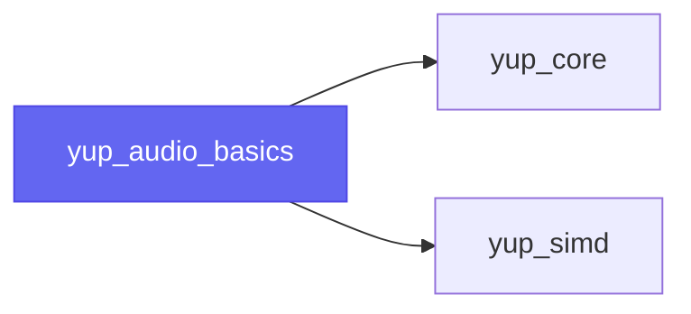

### yup_audio_devices

Real-time audio and MIDI I/O: enumerate, open, and stream from the platform's
audio and MIDI devices.

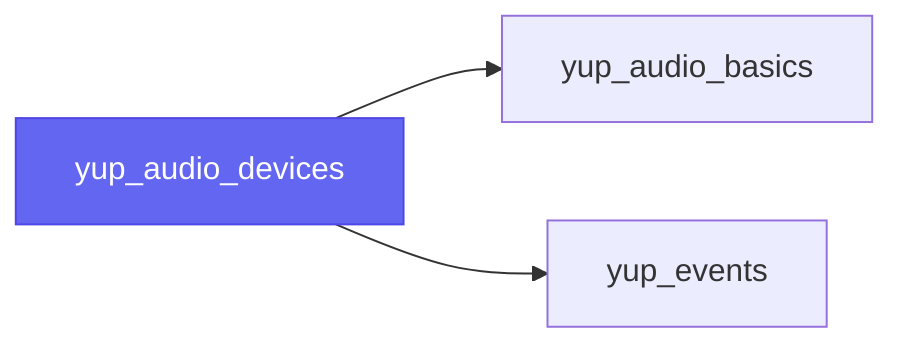

### yup_audio_formats

Reading and writing audio files across the supported sound formats. Codec
support is optional and enabled by linking the matching library: `dr_libs`
(WAV, MP3), `libvorbis` + `libogg` (Ogg Vorbis), `opus_library` (Opus),
`flac_library` (FLAC), plus `hmp3_library` as an alternative MP3 path. (CoreAudio
on Apple and Media Foundation on Windows are used automatically where available.)

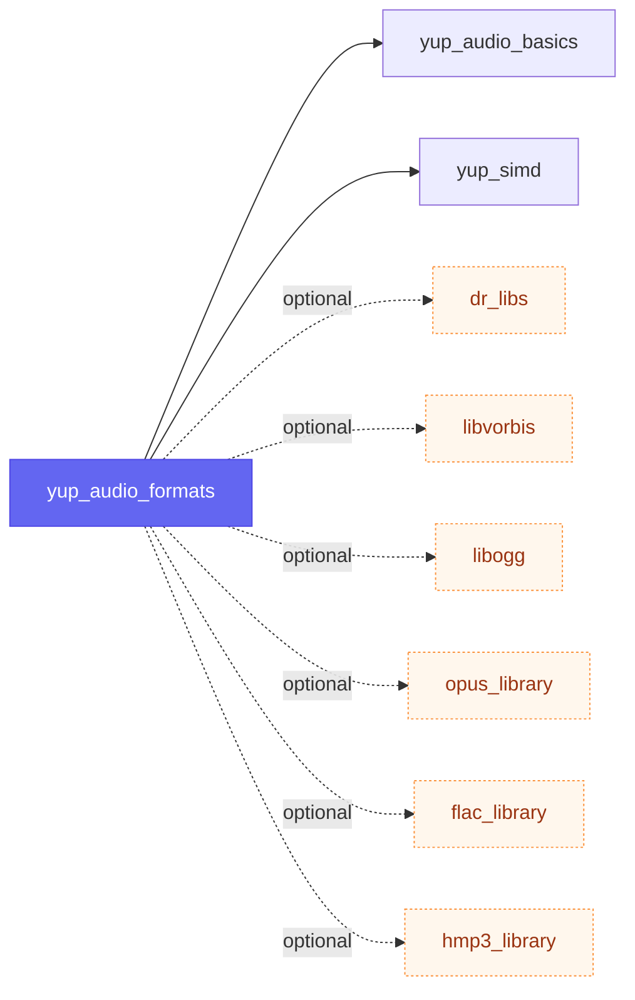

### yup_dsp

DSP building blocks: filters and filter designers, crossovers, and spectral
analysis. Optionally uses `pffft_library` for fast FFTs and `bungee_library`
for time-stretching / pitch-shifting when linked.

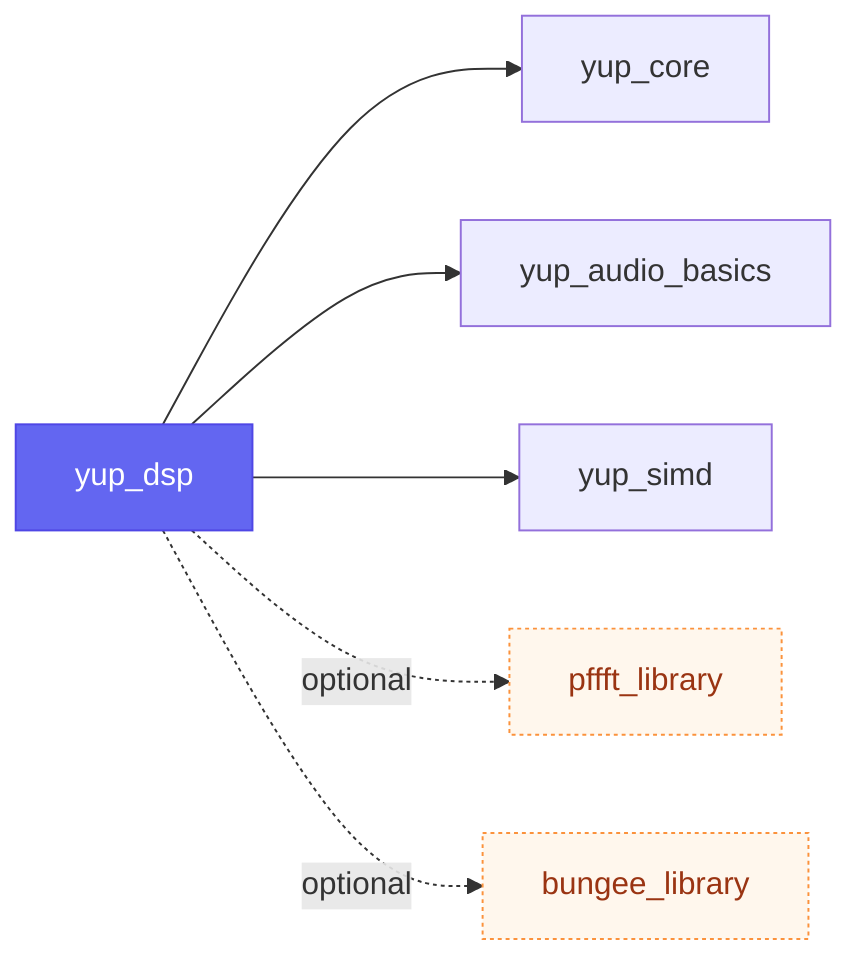

### yup_audio_processors

The `AudioProcessor` model - the unit of audio processing that plugins and the
audio graph are built from - plus parameter handling.

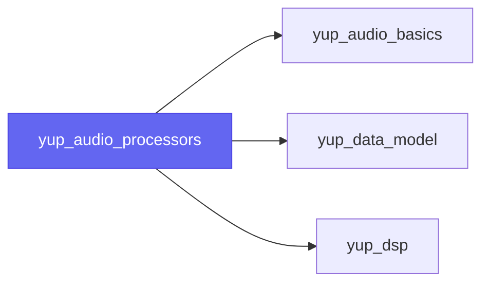

### yup_audio_graph

A node-based processing graph of `AudioProcessor`s for routing audio and MIDI,
backed by the data model.

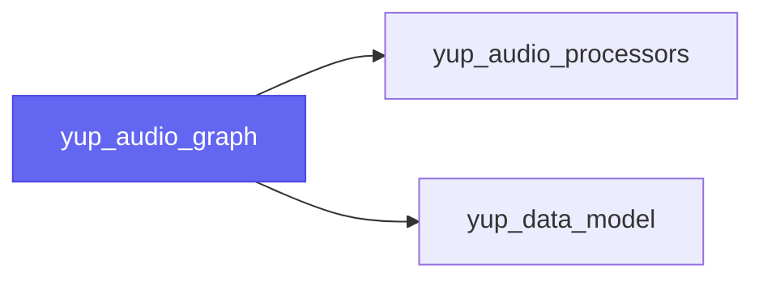

### yup_audio_plugin_client

Wrap your own `AudioProcessor` as a CLAP or VST3 plugin (and a standalone app).
See [Building plugins](build-system/building-plugins.md).

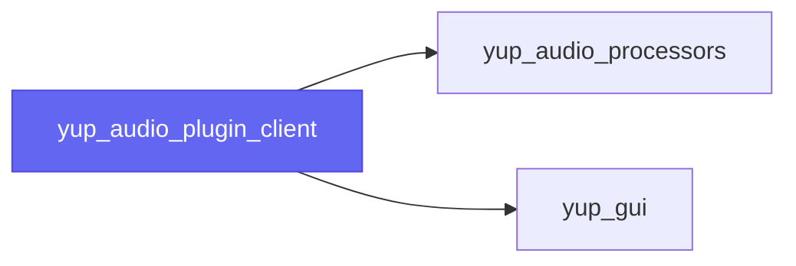

### yup_audio_plugin_host

In-process hosting of third-party VST3, CLAP, LV2, and AU (v2/v3) plugins.


## Scripting

Bindings for driving YUP from scripts. See the [Scripting](scripting/index.md) area.

### yup_python

Python bindings for creating and driving YUP applications from scripts. Its only
hard dependency is `yup_core`; it additionally generates bindings for
`yup_events`, `yup_data_model`, `yup_graphics`, `yup_gui`, `yup_ai`,
`yup_audio_basics`, `yup_audio_devices`, and `yup_audio_processors` when those modules are present in
the build.

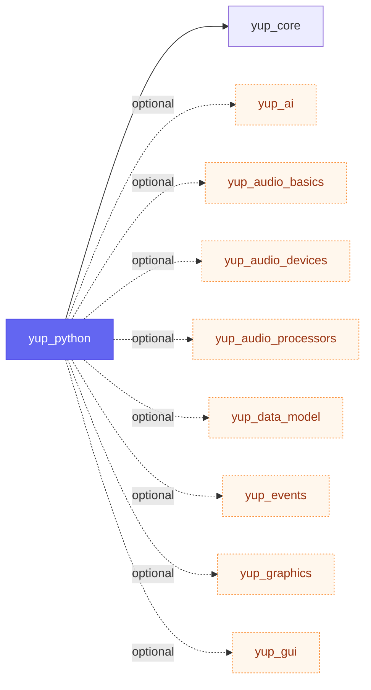

## Complete dependency graph

The full `yup_*` module graph of **required** dependencies in one view
(third-party and optional dependencies omitted for clarity).

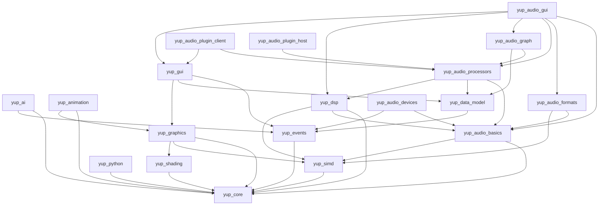

## See also

- [Module format](build-system/module-format.md) - how a module is declared.
- [CMake API](build-system/cmake-api.md) - how to add modules to your target.
