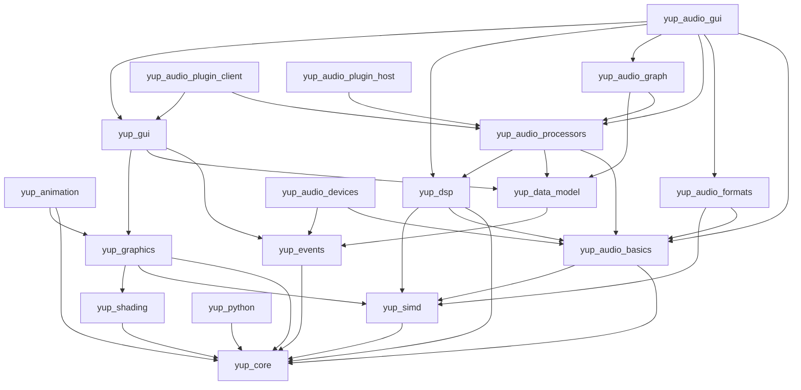

# Modules

YUP is organized into focused modules. Each module is a self-contained unit with
its own [module declaration](build-system/module-format.md) and follows the
`yup_*` naming convention. You depend on exactly the modules you need; transitive
dependencies are pulled in automatically by the [CMake API](build-system/cmake-api.md).

```{note}
All `yup_*` modules share the same version number. Modules also depend on a few
bundled third-party libraries (`zlib`, `rive`, `rive_renderer`, `libclipper2`,
`xsimd`), which are resolved for you by the build system.
```

## Modules by area

The modules map onto the documentation areas as follows.

### Core

| Module | Description | Depends on |
| ------ | ----------- | ---------- |
| `yup_core` | The essential set of basic YUP classes, required by all other modules. | `zlib` |
| `yup_simd` | SIMD operations using SSE, AVX, FMA, NEON, and the Accelerate framework. | `yup_core`, `xsimd` |

See the [Core](core/index.md) area.

### Multithreading & events

| Module | Description | Depends on |
| ------ | ----------- | ---------- |
| `yup_events` | The application main event loop, messages, timers, and async dispatch. | `yup_core` |

See the [Multithreading](multithreading/index.md) area. Threading primitives
themselves live in `yup_core`.

### Graphics

| Module | Description | Depends on |
| ------ | ----------- | ---------- |
| `yup_graphics` | The essential set of basic YUP graphics classes, including the RHI. | `yup_core`, `yup_simd`, `yup_shading`, `rive`, `rive_renderer`, `libclipper2` |
| `yup_shading` | Shader source, transpilation, and shader bundles. | `yup_core` |
| `yup_animation` | Lottie-compatible animation model with rendering and export. | `yup_core`, `yup_graphics` |

See the [Graphics](graphics/index.md) area. Bitmap image handling in
`yup_graphics` is documented separately in the [Imaging](imaging/index.md) area.

### UI

| Module | Description | Depends on |
| ------ | ----------- | ---------- |
| `yup_gui` | The essential set of basic YUP user-interface classes. | `yup_events`, `yup_data_model`, `yup_graphics`, `rive` |
| `yup_audio_gui` | Audio-related GUI components (waveforms, meters, spectrum, graph views). | `yup_audio_basics`, `yup_audio_formats`, `yup_audio_processors`, `yup_audio_graph`, `yup_dsp`, `yup_gui` |

See the [UI](ui/index.md) area. (`yup_audio_gui` bridges UI and audio.)

### Audio

| Module | Description | Depends on |
| ------ | ----------- | ---------- |
| `yup_audio_basics` | Audio buffer manipulation, MIDI message handling, synthesis, etc. | `yup_core`, `yup_simd` |
| `yup_audio_devices` | Play and record from audio and MIDI I/O devices. | `yup_audio_basics`, `yup_events` |
| `yup_audio_formats` | Audio file format readers and writers. | `yup_audio_basics`, `yup_simd` |
| `yup_dsp` | The essential set of basic YUP DSP (filters, designers, spectral analysis). | `yup_core`, `yup_audio_basics`, `yup_simd` |
| `yup_audio_processors` | The essential set of basic YUP audio processing classes. | `yup_audio_basics`, `yup_data_model`, `yup_dsp` |
| `yup_audio_graph` | `AudioProcessor`-based audio and MIDI processing graph. | `yup_audio_processors`, `yup_data_model` |
| `yup_audio_plugin_client` | Wrap your own processor as a CLAP / VST3 plugin. | `yup_audio_processors`, `yup_gui` |
| `yup_audio_plugin_host` | In-process hosting of VST3, CLAP, LV2, and AU (v2/v3) plugins. | `yup_audio_processors` |

See the [Audio](audio/index.md) area.

### Data

| Module | Description | Depends on |
| ------ | ----------- | ---------- |
| `yup_data_model` | The essential set of basic YUP data-model classes (`DataTree`). | `yup_events` |

See the [Data](data/index.md) area.

### Scripting

| Module | Description | Depends on |
| ------ | ----------- | ---------- |
| `yup_python` | Python bindings to create and work on YUP apps. | `yup_core` |

See the [Scripting](scripting/index.md) area.

## Dependency graph

The arrows point from a module to the `yup_*` modules it depends on. Third-party
dependencies are omitted for clarity.



## See also

- [Module format](build-system/module-format.md) - how a module is declared.
- [CMake API](build-system/cmake-api.md) - how to add modules to your target.
